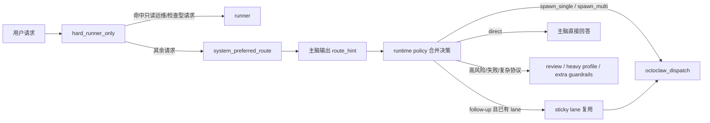

# OctoClaw 灰区路由设计 v1 (2026-03-27)

## 1. 文档目的

这份文档专门回答一个问题：

> **在没有“首 token 足够快”的独立 router 模型时，OctoClaw 怎么做稳定、低成本、不拖慢主链路的路由？**

当前结论与主产品文档保持一致，并明确收敛为：

- **代码只做极窄的 `hard_runner_only`**
- **其余请求交给稳定主脑输出 `route_hint`**
- **系统先产出 `system_preferred_route`，但这不是最终 route**
- **follow-up 请求允许复用 sticky lane**
- **最终执行权仍由 runtime policy 和 hook 掌握**

本设计是主产品文档的补充，默认与
[octoclaw-product-design-v2-2026-03-27.md](/Users/guanzhicheng/Documents/Playground/openclaw-projects/openclaw-octopus/octoclaw-product-design-v2-2026-03-27.md)
保持一致。

---

## 2. 先给结论

OctoClaw 第一版不应默认依赖：

- 前置远程 cheap router LLM
- 前置本地 embedding 分类器
- 前置本地小 LLM judge

原因很简单：

- 远程 router LLM 会拖慢主链路
- 本地分类器虽然可行，但第一版不是必需项
- 纯代码规则无法可靠理解所有 `direct` 语义

所以第一版最稳的路线是：

1. **`hard_runner_only`**
2. **主脑输出结构化 `route_hint`**
3. **runtime policy / hook 执行强约束**
4. **记录 replay / route_hint / block event**
5. **灰区分类器保留为后续可插拔增强**

也就是说：

> **第一版先解决“稳定委派”，不是先解决“完美自动分流”。**

---

## 3. 为什么不前置独立 router LLM

### 3.1 如果远程模型不够快，主链路会被拖慢

前置 router LLM 意味着每条请求都会多一次模型往返：

- 先等 router 模型
- 再等主脑
- 再等 worker

如果 router 模型首 token 需要秒级：

- 首响体验会明显变差
- `runner` 的快路径价值会被吃掉
- 系统复杂度会上升，但未必带来等价收益

### 3.2 “都交给主脑”也不是完全坏事

如果没有足够快的独立 router 模型，那么：

- 不要再额外加一层慢 router
- 让主脑在同一轮里做 `direct` 或 `delegate` 判断

这是比“前面再排队一次远程路由器”更现实的方案。

### 3.3 但也不能让主脑统治一切

即使灰区交给主脑，系统仍然必须保留：

- 高风险禁令
- review gate
- 最大 fan-out
- 非 direct 时的工具约束
- `octoclaw_dispatch` 强制入口

所以当前最佳平衡是：

> **主脑负责灰区理解，系统负责执行约束。**

---

## 4. 当前推荐架构



原则：

- **代码只切超明显 `runner`**
- **`direct` 不做纯代码硬判**
- **主脑可以建议 route，但系统掌握最终执行权**
- **`system_preferred_route` 只是系统偏好，不是最终裁决**

---

## 4.1 `system_preferred_route` 和最终 route 的区别

当前实现里，系统仍会先根据规则和任务特征给出一个 `system_preferred_route`。

它的职责是：

- 给主脑一个起始偏好
- 给 replay / eval 一个稳定参考值
- 给 runtime policy 一个 merge 起点

它不等于最终 route。最终 route 的形成顺序是：

1. `hard_runner_only`
2. `system_preferred_route`
3. `route_hint`
4. `sticky lane`
5. runtime policy 的 veto / downgrade / upgrade

所以更准确的说法是：

> **OctoClaw 先算系统偏好，再做 route merge，而不是先算死最终路由。**

---

## 5. `hard_runner_only` 的边界

### 5.1 为什么只保留 `hard_runner_only`

之前讨论过“同时做 `hard_direct` 和 `hard_runner`”，但最后收敛后发现：

- `runner` 对应的任务边界更机械、更可模式化
- `direct` 的语义范围太宽，强行用规则切会很快退化成关键词工程

所以当前建议是：

- **保留 `hard_runner_only`**
- **不做 `hard_direct`**

### 5.2 什么任务才能命中 `hard_runner_only`

只允许这类请求直接走 runner：

- 明显是只读状态检查
- 明显是日志/端口/进程/文件读取
- 明显是工具边界清楚的小任务
- 明显不是改代码、写方案、调研、长文档

例如：

- “看下 8080 端口开了没”
- “查最近 100 行 nginx 错误日志”
- “搜一下这个目录里有没有 apiKey”
- “curl 一下 health endpoint”

### 5.3 这层仍然是规则，但范围极窄

这层不追求“理解任务”，只追求：

- 高精度
- 低误判
- 少覆盖

也就是说：

> **宁可很多请求进灰区，也不要把复杂任务误判成 runner。**

---

## 6. 主脑在灰区里到底做什么

主脑不是先直接执行任务，而是先输出结构化建议，例如：

```json
{
  "route_hint": "direct",
  "work_type": "research",
  "phase": "inspect",
  "review_required": false,
  "confidence": 0.72,
  "reason": "question_is_explanatory_but_not_runner_safe"
}
```

这里主脑负责：

- 判断更像 `direct` 还是 `delegate`
- 判断更像 `code / research / writer / review`
- 判断是否应该默认附带 review

这里主脑**不负责**：

- 直接无限派 agent
- 绕开 `octoclaw_dispatch`
- 绕开工具约束
- 自己决定最终最大 fan-out

---

## 7. 系统强约束怎么落

即使主脑输出了 `route_hint`，真正执行时仍然由系统掌控：

### 7.1 `direct`

- 允许主脑直接回答
- 允许正常工具使用

### 7.2 `spawn_single` / `spawn_multi`

- 必须通过 `octoclaw_dispatch`
- 非 direct 场景禁止主脑直接乱用非控制型工具
- 默认 skill bundle 由 runtime policy 注入
- 高风险默认打开 review gate
- `route_hint`、merge 结果、tool block、agent_end 进入 replay log

### 7.3 `runner`

- 只有 `hard_runner_only` 才能在前置阶段直接 runner
- 其他“看起来像 runner 但其实也可能要分析”的任务，不在这里自动切

所以最终原则是：

> **主脑给建议，系统做执行裁决。**

---

## 7.1 `route stickiness`

为了减少 lane 抖动，OctoClaw 需要保留一个保守的 sticky lane 机制：

- 同一个 session 一旦进入 `spawn_single` 或 `spawn_multi`
- 后续带有明显 follow-up 语气的请求，例如：
  - `继续`
  - `下一步`
  - `再查一下`
  - `add tests`
  - `follow up`
- 可以优先沿用上一次 delegated lane，而不是每句都重新猜路由拓扑

这层 sticky lane 的边界是：

- 不适用于 `runner`
- 不替代 `route_hint`
- 不绕过 review gate
- 默认只对 follow-up 请求生效

所以它本质上是：

> **一个保守的 lane 复用机制，而不是新的路由器。**

---

## 8. 为什么第一版不急着上 classifier

### 8.1 当前首要问题不是“没有分类器”

当前最核心的问题是：

- 委派是否稳定
- 主脑会不会绕开 dispatch
- direct / delegate 边界能不能被 runtime enforcement 固定下来

这些问题没立住前，先上分类器的收益有限。

### 8.2 classifier 是后续增强，不是当前阻塞项

后续当然可以加：

- 超轻量文本分类器
- embedding + classifier
- 本地小 LLM judge

但这些应该放在：

- 主链路和 hook 稳定之后
- replay/eval 积累起来之后
- 真正发现灰区判断成为瓶颈之后

---

## 9. 后续 classifier 的正确位置

classifier 不是独立总调度器，而应作为 runtime policy 的可插拔 adapter。

未来更合理的演进是：

1. `hard_runner_only`
2. 主脑 `route_hint`
3. 记录 replay / 误判 / route reason
4. 在此基础上训练或引入 classifier
5. 先只让 classifier 辅助主脑，而不是取代主脑

也就是说：

> **第一版让主脑承担灰区判断，第二版再考虑把一部分灰区收回给 classifier。**

---

## 10. 当前推荐的实现顺序

### Phase A

- 落实 `hard_runner_only`
- 落实 `system_preferred_route + route_hint + sticky lane` 的 merge 语义
- 其余请求交主脑做 `route_hint`
- runtime policy hook 强制：
  - 非 direct 必须走 `octoclaw_dispatch`
  - 高风险自动 review
  - 非 direct 限制工具

推荐同时保留以下灰度开关：

- `runtime_policy.enabled`
- `runtime_policy.switches.hard_runner_only`
- `runtime_policy.switches.route_hint_required`
- `runtime_policy.switches.replay_logging`
- `runtime_policy.switches.direct_model_override`
- `runtime_policy.switches.delegation_enforcement`
- `runtime_policy.route_stickiness.enabled`
- `runtime_policy.route_language_packs.enabled`
- `runtime_policy.hooks.*`

多语言策略建议保持保守：

- 默认只开 `zh + en`
- 额外语言包按需启用：`ja / ko / es / pt / ru`
- command / shell 这类通用模式常驻即可
- 后续安装引导可以把语言包做成勾选项，但不要把所有自然语言词表默认全开

部署建议：

- 用独立 rollout 脚本安装 / 卸载 / 启停 runtime policy
- rollout 应支持显式覆盖 `route_language_packs.enabled`
  - 例如：`--route-language-packs zh,en,ja,es`
- 默认先走 `conservative`
- 等 replay 稳定后再升到 `guided` 或 `enforced`

### Phase B

- 记录 replay
- 记录主脑 `route_hint`
- 记录最终 route 和人工回看结果
- 固定 replay event schema：
  - [`schemas/runtime-policy-replay-event-v1.schema.json`](./schemas/runtime-policy-replay-event-v1.schema.json)
- 固定 replay fixtures：
  - [`tests/fixtures/runtime-policy-replay-events-v1.json`](./tests/fixtures/runtime-policy-replay-events-v1.json)

### Phase C

- 分析哪些灰区模式其实稳定可收回
- 再决定是否引入 classifier

---

## 11. 不建议的方向

当前不建议：

- 为了“更智能”在主链路前再加一个慢 router LLM
- 为了“避免主脑判断”而强行做 `hard_direct`
- 把主脑 route_hint 直接当最终执行命令
- 让 classifier 一上来就决定一切

---

## 12. 一句话结论

> **OctoClaw 当前最现实的灰区路由方案，不是“硬门禁 + classifier 优先”，而是“`hard_runner_only` + 主脑 `route_hint` + 系统强约束”，classifier 留作下一阶段增强。**
