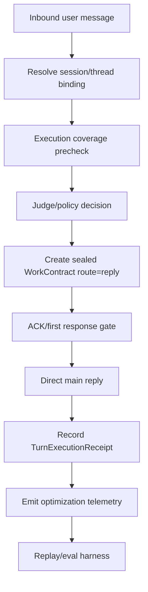
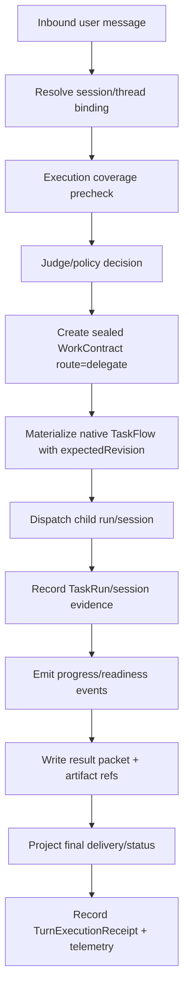
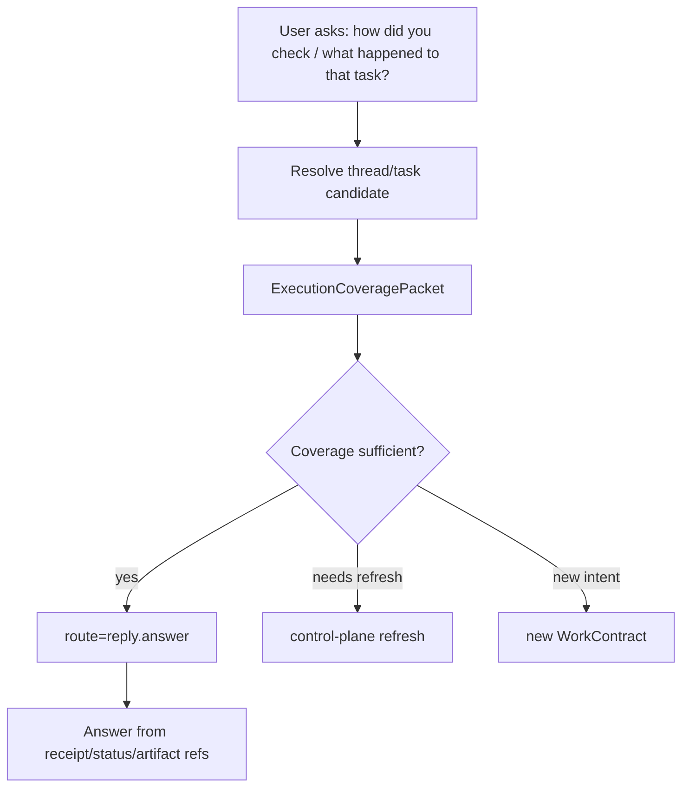

# OctoClaw Next Stage Roadmap and Execution Design

Date: 2026-04-25  
Target branch: `release/0.3.0-ts-rebuild`  
Audience: implementation AI / reviewer / future maintainer  
Status: proposal for next-stage execution, aligned with the current TS rebuild design

## 0. One-line Direction

OctoClaw next stage should first make runtime truth and measurement trustworthy, then build user-visible status, cost/model optimization, controlled multi-agent, and harness self-evolution on top of that truth.

In short:

> First make OctoClaw able to prove what happened, how long it took, what it cost, and whether the result was better. Then optimize.

## 1. Source Map

This design intentionally does not replace the existing documents. It is a roadmap and execution bridge that cross-references them.

Primary current docs:

1. [octoclaw-ts-rebuild-design-v1.md](../octoclaw-ts-rebuild-design-v1.md)
   - Core purpose: fast first response, on-demand delegation, stable lifecycle, cost-aware model use.
   - Updated with WorkContract-centered delegation and measurable cost/speed principles.
2. [octoclaw-work-contract-centered-delegation-design-2026-04-25.md](./octoclaw-work-contract-centered-delegation-design-2026-04-25.md)
   - Canonical WorkContract-centered delegation design.
3. [octoclaw-work-contract-implementation-plan-2026-04-25.md](./octoclaw-work-contract-implementation-plan-2026-04-25.md)
   - Detailed WorkContract implementation WPs.
4. [octoclaw-ts-rebuild-gap-closure-implementation-plan-2026-04-24.md](./octoclaw-ts-rebuild-gap-closure-implementation-plan-2026-04-24.md)
   - Gap closure, including Judge Context Coverage / Execution Coverage packet.
5. [octoclaw-judge-ack-policy-spec-2026-04-21.md](./octoclaw-judge-ack-policy-spec-2026-04-21.md)
   - ACK/judge policy, provenance exception, context coverage rules.
6. [octoclaw-design-refresh-2026-04-12.md](./octoclaw-design-refresh-2026-04-12.md)
   - Refresh that restated the user goals: faster, cheaper, better UX, then exploration.
7. [octoclaw-harness-ownership-map.md](./octoclaw-harness-ownership-map.md)
   - Runtime / workflow / evaluation harness ownership split.
8. [octoclaw-harness-contract-inventory.md](./octoclaw-harness-contract-inventory.md)
   - Canonical brief/result/artifact/event/eval contracts.
9. [octoclaw-slack-acceptance-results-2026-04-12.md](./octoclaw-slack-acceptance-results-2026-04-12.md)
   - Current Slack acceptance gaps.
10. [archive/design-notes/octoclaw-anthropic-agent-engineering-notes-v1-2026-03-30.zh-CN.md](./archive/design-notes/octoclaw-anthropic-agent-engineering-notes-v1-2026-03-30.zh-CN.md)
   - Anthropic borrowing notes: workflow-first, context engineering, long-running harness, eval discipline, selective multi-agent.

OpenClaw source reference already used by the WorkContract plan:

- `openclaw/openclaw` `release/2026.4.21` / `v2026.4.21`
- commit `f788c88b4c508c335336fb292afed8c900656d6d`
- package version `2026.4.21`

Relevant Anthropic public sources:

1. [Building effective agents](https://www.anthropic.com/engineering/building-effective-agents)
2. [Effective context engineering for AI agents](https://www.anthropic.com/engineering/effective-context-engineering-for-ai-agents)
3. [How we built our multi-agent research system](https://www.anthropic.com/engineering/multi-agent-research-system)
4. [Effective harnesses for long-running agents](https://www.anthropic.com/engineering/effective-harnesses-for-long-running-agents)
5. [Demystifying evals for AI agents](https://www.anthropic.com/engineering/demystifying-evals-for-ai-agents)
6. [Writing effective tools for agents](https://www.anthropic.com/engineering/writing-tools-for-agents)

## 2. First Principles

The original product goal is not "more agents". It is:

1. Cost: use stronger or more expensive models only when needed.
2. Efficiency: do not block the main agent on long-running work.
3. Effectiveness: avoid polluting the main-agent context; use workflows and artifacts to make results more reliable.
4. UX: provide timely ACK, truthful status, and later a multi-task status panel.
5. Learning loop: use harness, replay, telemetry, and gates to make the system improve safely.
6. Evaluation: prove whether the system is faster and cheaper at equal or better quality.

The optimization target should be:

```text
successful_user_outcome / (latency + cost + context_pollution + operational_risk)
```

That means a change is not successful just because it uses a cheaper model or spawns more workers. It is successful only if:

1. acceptance quality does not regress,
2. runtime truth remains auditable,
3. parent context remains compact,
4. cost per successful outcome improves,
5. user-visible latency does not regress for the lane being optimized.

## 3. Product Positioning

OctoClaw is:

1. execution policy on top of OpenClaw,
2. delegation harness,
3. context hygiene layer,
4. user-visible status projection layer,
5. cost/speed measurement and promotion gate,
6. future controlled multi-agent coordinator.

OctoClaw is not:

1. a new general agent SDK,
2. a second task engine beside OpenClaw native TaskFlow,
3. a tmux-first runtime,
4. a ClawTeam-first runtime,
5. a prompt-only delegation scheme,
6. a default research-style multi-agent system.

## 4. Highest Priority

The highest priority is:

> P0: Truth spine plus measurement gate.

This means:

1. Native TaskFlow remains execution lifecycle truth.
2. TaskRun/session/process evidence proves real execution.
3. WorkContract is semantic/delegation/handoff/continuity truth.
4. ExecutionCoveragePacket is provenance/status evidence.
5. Artifact index is durable content truth.
6. ACK/status/display/grounding are projections only.
7. Optimization telemetry is collected at request/task/flow levels.
8. Harness gates compare speed, cost, quality, and context pollution before promotion.

Why this must come first:

1. Without truth spine, ACK and status panel will lie or drift.
2. Without TaskRun/session evidence, "spawned" and "registered" will be confused.
3. Without compact projections, the main agent will keep absorbing child context.
4. Without telemetry, faster/cheaper claims are subjective.
5. Without harness gates, self-evolution becomes prompt tweaking.

## 5. Current Codebase Alignment

The current TS rebuild already has useful pieces. The next work should extend these pieces, not create a parallel runtime.

Important current modules:

1. `packages/octoclaw-contracts`
   - Existing contract package.
   - Has `telemetry.ts`, `delegate.ts`, `delegate-context.ts`, `events.ts`, `results.ts`, `artifacts.ts`, `thread-binding.ts`.
   - Add WorkContract, status projection, execution coverage, and optimization gate contracts here.
2. `packages/octoclaw-policy`
   - Existing policy / judge / role / model / caps / route package.
   - Add sealed WorkContract creation after judge/validator.
   - Keep route/backend/model authority out of the main agent.
3. `packages/octoclaw-runtime-core`
   - Existing workflow/task/ack/delivery/recovery/telemetry skeleton.
   - Has `RuntimeWorkflowState`, `RuntimeTaskMaterializationPacket`, task claims, deadlines, delivery outbox.
   - Extend this toward native TaskFlow binding, TaskRun evidence, status projection inputs, and telemetry events.
4. `extensions/octoclaw-runtime`
   - Existing live runtime integration.
   - Has ACK guard/timing/templates, context budget, delegate packets, conversation grounding, taskflow adapter/ports, replay logger, execution coverage precheck.
   - This is the integration point for WorkContract creation, dispatch materialization, ACK/status projection, replay, and harness fixtures.
5. `extensions/octoclaw-fast-reply`
   - Existing fast reply / ACK instrumentation.
   - Should consume request-level telemetry, not own route truth.
6. `extensions/octoclaw-status-surface`
   - Existing status surface package.
   - Should become the user/operator projection of task state, not a separate state store.
7. `extensions/octoclaw-delegation`
   - Existing delegation package.
   - Should consume sealed WorkContract and native TaskFlow refs.

## 6. Authority Model

### 6.1 Truth Sources

| Concern | Authoritative source | Not authoritative |
| --- | --- | --- |
| Execution lifecycle | OpenClaw Native TaskFlow | WorkContract alone, ACK text, chat history |
| Dispatch/materialization proof | Native TaskFlow materialization / TaskRecord evidence | route choice, ACK text, WorkContract status alone |
| Spawn/execution proof | Current TaskRun/session/process evidence | TaskFlow creation alone, prior WorkContract continuity, prior child session refs |
| Semantic decision | WorkContract | ad hoc `_judge_*`, legacy route fields |
| Provenance/status follow-up | ExecutionCoveragePacket | memory-only match, transcript guess |
| Durable result content | Artifact index/result packet | parent context dump |
| Parent-visible context | MainContextPacket projection | raw child transcript |
| Child continuation | childSessionKey/runId binding | prompt-only "continue" |
| Cost/speed claim | Optimization telemetry + harness gate | manual impression |
| UX surface | StatusProjection generated from truth sources | UI-local mutable state |

### 6.2 WorkContract Role

WorkContract should answer:

1. What did the system decide?
2. Why is this a reply or delegate?
3. What work is allowed?
4. What tools/model/profile/backend are allowed?
5. What compact handoff should a child see?
6. What compact summary should the parent see?
7. Which native flow/task/run/session proves execution?
8. Which artifact refs hold durable details?
9. How should follow-up continue?

WorkContract must not become:

1. a duplicate TaskFlow lifecycle engine,
2. a full transcript store,
3. a route-rationale dumping ground,
4. a replacement for TaskRun/session evidence,
5. a hidden mutable state bag.

### 6.3 Native TaskFlow Role

Native TaskFlow should answer:

1. Which flow exists?
2. Which task exists?
3. What is the lifecycle phase?
4. What revision is current?
5. Which mutation was applied?
6. Which owner/controller owns the flow?

Any mutation must use:

```text
flowId + expectedRevision
```

`TaskFlow created` is not proof that a child agent actually ran.

### 6.4 TaskRun/session Evidence Role

TaskRun/session/process evidence should answer:

1. Did dispatch execute?
2. Did child spawn actually execute?
3. What childSessionKey was created or resumed?
4. What runId exists?
5. Did the child produce progress, readiness, final result, or failure?
6. Is the child still active, stale, blocked, or dead?

The status surface must use these fields to distinguish:

1. registered,
2. materializing,
3. queued,
4. running,
5. blocked,
6. deliverable_ready,
7. completed,
8. failed,
9. timed_out,
10. canceled.

### 6.5 Projection Role

Projection is not truth. Projection is a read model for the user, operator, main agent, or worker.

Projection examples:

1. ACK decision packet.
2. MainContextPacket.
3. DelegateHandoffPacket.
4. DelegateStatusPacket.
5. ExecutionCoveragePacket.
6. TaskStatusProjection.
7. MultiTaskStatusProjection.

Projection rules:

1. Always include compact IDs and refs.
2. Never include full raw transcript by default.
3. Never infer "running" from TaskFlow creation alone.
4. Never let UI-local state override runtime truth.
5. Never promote stored continuity refs (`preferredChildSessionKey`, prior `runId`, prior `nativeBinding`) into current-turn `spawnExecuted=true`.
6. Every projection should include enough refs for retrieval, not enough bulk to pollute parent context.

Implementation note, 2026-04-26:

- `dispatchExecuted=true` means Native TaskFlow was materialized or a dispatch mutation was applied.
- `spawnExecuted=true` requires current dispatch evidence: `runId`, `childRunId`, `childSessionId`, current `childSessionKey`, or an explicit spawn boolean from runtime evidence.
- A prior WorkContract continuity handle remains a resume hint only. It may be shown in status, but it must not make a new materialized task appear running.
- If materialization succeeds but no spawn evidence is present, the projected state is `queued/materialized_no_spawn`, delivery relay registration is blocked, and the parent-visible coverage summary must say spawn was not confirmed.

## 7. End-to-End Runtime Flow

### 7.1 Normal Reply Lane



Reply lane success:

1. ACK/first response is not blocked by complex delegation logic.
2. Direct answer succeeds without unnecessary delegate spawn.
3. Provenance/status follow-up can cite execution coverage.
4. Cost/request and latency/request are recorded.

### 7.2 Delegated Lane



Delegated lane success:

1. Main agent returns quickly or is not held hostage by long-running child work.
2. Child sees compact handoff, not full parent history.
3. Parent sees compact status/result, not full child transcript.
4. Status panel truthfully distinguishes registered/materializing/running/completed/failed.
5. Follow-up can resume child session or cite result artifacts.

### 7.3 Status/Provenance Follow-up



Rules:

1. Provenance/status follow-up with sufficient execution coverage must not dispatch/spawn.
2. Memory coverage does not override execution coverage.
3. If execution says `dispatchExecuted=false`, answer honestly.
4. If `dispatchExecuted=true` but `spawnExecuted=false`, answer "registered/materialized but not actually spawned/executed".
5. If result exists, cite result/artifact refs compactly.

## 8. Multi-task Status Surface

This is part of the user experience projection, not a later decorative UI.

The user must be able to answer:

1. What tasks exist?
2. Which tasks are running?
3. How long has each task run?
4. Which model/profile/backend is used?
5. What is the task summary?
6. Did it succeed or fail?
7. What was the last progress?
8. Where are the result artifacts?
9. What did it cost?
10. Can I retry/cancel/resume?

### 8.1 TaskStatusProjection Contract

Add this contract under `packages/octoclaw-contracts`, likely in:

```text
packages/octoclaw-contracts/src/status-projection.ts
```

Initial shape:

```ts
export type TaskProjectionStatus =
  | "registered"
  | "materializing"
  | "queued"
  | "running"
  | "blocked"
  | "deliverable_ready"
  | "completed"
  | "failed"
  | "timed_out"
  | "canceled";

export interface TaskStatusProjection {
  schemaVersion: "octoclaw.task_status_projection/v1";
  projectionId: string;
  generatedAt: string;

  requestId: string;
  flowId: string;
  taskId: string;
  workContractId?: string;
  parentThreadKey?: string;

  title: string;
  summary: string;
  route: "reply" | "delegate" | "compound";
  role: string;
  coordinationMode?: "solo_worker" | "advisor_assisted" | "threaded_subagents" | "multi_agent_controlled";
  backend: string;

  modelProfile: string;
  modelId?: string;
  fallbackModelId?: string;

  status: TaskProjectionStatus;
  statusReason?: string;
  failureCode?: string;
  failureMessage?: string;

  createdAt: string;
  materializedAt?: string;
  queuedAt?: string;
  startedAt?: string;
  lastProgressAt?: string;
  deliverableReadyAt?: string;
  completedAt?: string;
  failedAt?: string;
  elapsedMs: number;

  dispatchExecuted: boolean;
  spawnExecuted: boolean;
  resultMaterialized: boolean;
  nativeFlowRevision?: number;
  nativeFlowExpectedRevision?: number;

  childSessionKey?: string;
  childSessionId?: string;
  childRunId?: string;

  lastProgressSummary?: string;
  resultSummary?: string;
  artifactRefs: string[];

  estimatedCostUsd?: number;
  actualCostUsd?: number;
  inputTokens?: number;
  outputTokens?: number;
  totalTokens?: number;

  actions: Array<"open" | "details" | "retry" | "cancel" | "resume" | "copy_ref">;
}
```

### 8.2 MultiTaskStatusProjection Contract

Add:

```ts
export interface MultiTaskStatusProjection {
  schemaVersion: "octoclaw.multi_task_status_projection/v1";
  projectionId: string;
  generatedAt: string;
  scope: "thread" | "user" | "workspace" | "system";
  threadKey?: string;
  userKey?: string;
  workspaceKey?: string;

  activeCount: number;
  blockedCount: number;
  completedRecentCount: number;
  failedRecentCount: number;
  totalEstimatedCostUsd?: number;
  totalActualCostUsd?: number;

  tasks: TaskStatusProjection[];
}
```

### 8.3 Field Authority Matrix

| Field | Source |
| --- | --- |
| `requestId`, `flowId`, `taskId` | WorkContract + native TaskFlow |
| `title`, `summary` | WorkContract compact view / result packet |
| `route`, `role`, `coordinationMode`, `backend` | sealed WorkContract / policy decision |
| `modelProfile`, `modelId` | WorkContract + telemetry |
| `status` | native TaskFlow + TaskRun/session evidence |
| `dispatchExecuted` | dispatch/materialization receipt |
| `spawnExecuted` | TaskRun/session/process evidence |
| `resultMaterialized` | result packet/artifact index evidence |
| `elapsedMs` | timestamps from lifecycle/telemetry |
| `cost/tokens` | optimization telemetry |
| `artifactRefs` | artifact index/result packet |
| `actions` | policy guard + current status |

### 8.4 No-lie Rules

The status surface must follow these hard rules:

1. If native flow exists but there is no dispatch evidence, status is `registered` or `materializing`, not `running`.
2. If `dispatchExecuted=true` but `spawnExecuted=false`, status can be `queued` or `materializing`, not `running`.
3. If `spawnExecuted=true` and heartbeat/progress exists, status can be `running`.
4. If last heartbeat is stale and no final result exists, status must become `blocked` or `timed_out` after the configured deadline.
5. If final result exists but delivery is pending, status is `deliverable_ready`.
6. If delivery is acknowledged and result materialized, status is `completed`.
7. If failure receipt exists, status is `failed` and must expose `failureCode`.
8. UI must never infer success from a friendly ACK.
9. Main agent must consume `TaskStatusProjection`, not raw logs.

### 8.5 User-facing Status Queries

Status follow-up should support these prompts without spawning:

1. "刚才那个任务怎么样了?"
2. "哪个任务还在跑?"
3. "跑了多久?"
4. "用的哪个模型?"
5. "那个任务成功了吗?"
6. "失败原因是什么?"
7. "结果在哪?"
8. "刚才派发了吗，还是只是登记了?"

All of these should route to `reply.answer` if coverage is sufficient.

## 9. Telemetry and Evaluation

### 9.1 Telemetry Levels

Telemetry must be collected at three levels:

1. Request
   - One inbound user message / one main turn.
   - Key metrics: `ack_ms`, `route_decision_ms`, `total_latency_ms`, `cost_per_request`.
2. Task
   - One materialized delegated unit.
   - Key metrics: `task_materialize_ms`, `queue_wait_ms`, `first_progress_ms`, `final_delivery_ms`, `cost_per_success`.
3. Flow
   - One parent job or group.
   - Key metrics: flow success rate, terminal correctness, recoverability, total cost.

The existing `packages/octoclaw-contracts/src/telemetry.ts` already has an `OptimizationTelemetry` shape. Extend it rather than creating a separate metrics system.

### 9.2 Required Fields

At minimum:

1. `requestId`
2. `taskId`
3. `flowId`
4. `route`
5. `role`
6. `coordinationMode`
7. `backend`
8. `workspaceMode`
9. `modelProfile`
10. `modelId`
11. `ackMs`
12. `routeDecisionMs`
13. `taskMaterializeMs`
14. `queueWaitMs`
15. `ttftMs`
16. `firstProgressMs`
17. `finalDeliveryMs`
18. `totalLatencyMs`
19. `inputTokens`
20. `outputTokens`
21. `totalTokens`
22. `estimatedCostUsd`
23. `actualCostUsd`
24. `retryCount`
25. `fallbackCount`
26. `failureCode`
27. `terminalState`
28. `parentContextTokensAdded`
29. `resultPacketTokens`
30. `artifactReopenCount`

### 9.3 Success Criteria

Reply lane succeeds when:

1. `ack_ms` improves or stays within target.
2. `total_latency_ms` improves or stays within target.
3. direct reply correctness does not regress.
4. `cost_per_request` improves at equal quality.

Delegate lane succeeds when:

1. `task_materialize_ms` is bounded.
2. `first_progress_ms` is bounded.
3. `final_delivery_ms` improves or stays within target.
4. `cost_per_success` improves at equal acceptance.
5. fallback/timeout rate does not regress.
6. parent context tokens do not grow unbounded.

Compound/multi-agent succeeds when:

1. flow success rate improves.
2. terminal correctness improves.
3. recoverability improves.
4. total cost stays within budget.
5. final delivery latency does not regress beyond gate.

### 9.4 Gate Rule

No optimization should be promoted unless the gate has:

1. baseline report,
2. candidate report,
3. acceptance/replay comparison,
4. cost comparison,
5. latency comparison,
6. context pollution comparison,
7. rollback path.

## 10. Cost and Model-on-demand Strategy

### 10.1 Initial Principle

Do not start with automatic online model tuning.

Start with:

1. fixed lane/profile mapping,
2. runtime telemetry,
3. offline report,
4. shadow recommendation,
5. gated promotion.

### 10.2 Execution Package

Auto routing should eventually choose an execution package, not only a model:

```ts
export interface ExecutionPackage {
  route: "reply" | "delegate" | "compound";
  role: string;
  coordinationMode: "solo_worker" | "advisor_assisted" | "threaded_subagents" | "multi_agent_controlled";
  backend: "openclaw-native" | "runner" | "clawteam" | "tmux-workbench" | string;
  workspaceMode: "shared_workspace" | "isolated_workspace";
  modelProfile: string;
  modelId?: string;
  advisorPolicy?: string;
}
```

### 10.3 v1/v2 Model Policy

Recommended early behavior:

1. Keep `judge_fast` cheap and bounded, but do not let it own final answer quality.
2. Keep `direct_main` strong enough for user-facing answer quality.
3. Use fixed worker profiles for delegated work.
4. Keep local/cheap model use in shadow or low-risk helper lanes until telemetry proves value.
5. Do not move advisor/multi-agent into live path until cost and latency gates pass.

### 10.4 What Counts as Cheaper

Cheaper means:

```text
actual_cost_usd / successful_outcome
```

It does not mean:

1. cheaper single model call,
2. shorter prompt at the cost of bad result,
3. more fallback retries,
4. lower quality hidden by missing evals,
5. moving cost from main model to many child models without measuring total flow cost.

## 11. Multi-agent Strategy

### 11.1 Default

Default live path should remain:

```text
solo_worker
```

This follows:

1. existing main design,
2. Anthropic "workflow-first, agent-second" direction,
3. OMO-style LLM + tool affordance dispatch principle,
4. current cost/latency risk.

### 11.2 When to Use Multi-agent

Allow multi-agent only when all are true:

1. task is decomposable,
2. subtasks can run in parallel,
3. subtask outputs can be merged through artifacts,
4. parent context can remain compact,
5. there is a clear owner/arbiter,
6. cost budget supports it,
7. latency budget supports it,
8. harness has a comparable solo baseline,
9. expected quality or latency gain beats cost increase.

### 11.3 Advisor-assisted Mode

Phase 2 can add skeleton only:

1. `advisor_policy`,
2. `advice_packet`,
3. consult adapter,
4. shadow report.

Do not default live path to advisor-assisted until:

1. advisory result improves quality,
2. final delivery latency passes gate,
3. cost per success passes gate,
4. hallucination/over-delegation cases are covered by evals.

### 11.4 Threaded Subagents

Threaded subagents should be Phase 3+ only.

Constraints:

1. one-level delegation first,
2. fixed callable roles first,
3. no arbitrary recursive swarm,
4. every child has a WorkContract/TaskFlow/TaskRun binding,
5. every child produces compact result packet and artifact refs,
6. parent sees merged projection, not child transcripts.

### 11.5 OMO Borrowing

Borrow:

1. LLM decides when to use tools/subagents under prompt + tool affordance.
2. Project docs/AGENTS.md-style constraints guide behavior but are not the scheduling core.
3. Session continuity matters.
4. The parent should receive stable handles and results, not all child conversation.

Do not borrow:

1. prompt-only hidden state as execution truth,
2. raw transcript stitching into the parent,
3. unconstrained delegation based on "complexity feels high".

In OctoClaw, OMO-style continuity must become:

```text
childSessionKey + runId + WorkContract + artifact refs + TaskRun/session evidence
```

## 12. Harness Self-evolution

Self-evolution should not mean "router auto-mutates itself online".

It should mean:

```mermaid
flowchart LR
  A["Production telemetry"] --> B["Replay sample"]
  B --> C["Failure cluster"]
  C --> D["Fixture/eval added"]
  D --> E["Policy/model candidate"]
  E --> F["Shadow recommendation"]
  F --> G["Harness gate"]
  G --> H["Promotion"]
  H --> I["Monitor"]
  I --> J["Rollback if regress"]
```



### 12.1 Allowed Self-evolution Outputs

Harness may propose:

1. policy threshold changes,
2. model profile mapping changes,
3. advisor policy changes,
4. route fallback rule changes,
5. new fixtures,
6. new failure codes,
7. new status/ACK edge cases.

Harness must not directly:

1. change live route policy online,
2. enable multi-agent live path without gate,
3. remove safety constraints,
4. promote a cheaper model without equal-quality evidence.

### 12.2 Promotion Bundle

Any promoted bundle should include:

1. bundle id,
2. route policy version,
3. model profile map version,
4. advisor policy version,
5. gate report path,
6. rollback target,
7. expected metric deltas,
8. acceptance scenario coverage.

## 13. Work Packages

This section is written as a handoff for another implementation AI.

### P0.WP0 Baseline Tests and Current Behavior Audit

Goal:

Create failing or characterization tests before behavior changes.

Files to inspect:

1. `extensions/octoclaw-runtime/src/replay/turn-execution-receipt.test.ts`
2. `extensions/octoclaw-runtime/src/resolve/llm-judge.test.ts`
3. `extensions/octoclaw-runtime/src/resolve/judge-context-packet.test.ts`
4. `extensions/octoclaw-runtime/src/tools/registration-dispatch-honesty.test.ts`
5. `extensions/octoclaw-runtime/src/context/delegate-packets.test.ts`
6. `extensions/octoclaw-runtime/src/ack/ack-guard.test.ts`
7. `extensions/octoclaw-runtime/src/adapter/runtime-taskflow.test.ts`
8. `packages/octoclaw-contracts/src/telemetry.ts`
9. `packages/octoclaw-runtime-core/src/workflow/index.ts`
10. `packages/octoclaw-runtime-core/src/tasks/index.ts`

Add/extend tests for:

1. provenance follow-up does not spawn,
2. status follow-up does not spawn,
3. TaskFlow created but no TaskRun evidence is not running,
4. dispatch executed but spawn not executed is honestly reported,
5. child session continuity chooses resume when same task follow-up,
6. main context packet does not include raw transcript,
7. status projection includes elapsed/model/summary/success/failure,
8. telemetry includes request/task/flow ids and cost/latency fields.

Acceptance:

1. Tests document current gaps.
2. No broad refactor in this WP.
3. Any snapshot changes must be intentional and explained.

### P0.WP1 Contract Additions

Goal:

Add canonical types without changing runtime behavior.

Files:

1. `packages/octoclaw-contracts/src/work-contract.ts`
2. `packages/octoclaw-contracts/src/execution-coverage.ts`
3. `packages/octoclaw-contracts/src/status-projection.ts`
4. `packages/octoclaw-contracts/src/optimization-gate.ts`
5. `packages/octoclaw-contracts/src/index.ts`
6. `packages/octoclaw-contracts/src/telemetry.ts`

Tasks:

1. Implement `WorkContract`, `ReplyContract`, `DelegateContract`, `WorkDecisionSeal`.
2. Implement `NativeBindingRef`.
3. Implement `ChildSessionContinuity`.
4. Implement `ExecutionCoveragePacket`.
5. Implement `TaskStatusProjection`.
6. Implement `MultiTaskStatusProjection`.
7. Extend `OptimizationTelemetry` with context pollution and actual cost fields.
8. Add unit tests for schema defaults and no-raw-transcript invariants.

Acceptance:

1. `pnpm --filter @octoclaw/contracts run build` passes.
2. Contract tests pass.
3. No runtime behavior changes yet.

### P0.WP1b Execution Coverage Precheck

Goal:

Make execution coverage authoritative before memory coverage or judge ambiguity.

Files:

1. `extensions/octoclaw-runtime/src/resolve/execution-coverage-precheck.ts`
2. `extensions/octoclaw-runtime/src/resolve/judge-context-packet.ts`
3. `extensions/octoclaw-runtime/src/resolve/policy-resolver.ts`
4. `packages/octoclaw-policy/src/spec/prompt-builder.ts`
5. `packages/octoclaw-policy/src/judge/judge-schema.ts`

Tasks:

1. Move ad hoc `recent_execution` into `packet.execution`.
2. Add `buildExecutionCoveragePrecheck(...)`.
3. Use execution coverage before memory coverage.
4. Encode sufficient provenance/status coverage as `reply.answer`.
5. Mark insufficient coverage as `control_plane_refresh` or `new_intent`, not blind delegate.

Acceptance:

1. "怎么查的" with sufficient previous execution evidence does not spawn.
2. "刚才那个任务判定是啥" can answer from ledger/receipt/status.
3. Memory-only similarity cannot claim tool/subagent usage.
4. Existing judge ACK policy tests still pass.

### P0.WP2 WorkContract Builder and Store

Goal:

Every resolved policy decision gets a sealed semantic contract.

Files:

1. `packages/octoclaw-policy/src/judge/judge-schema.ts`
2. `packages/octoclaw-policy/src/spec/decision-policy-spec.ts`
3. `extensions/octoclaw-runtime/src/resolve/policy-resolver.ts`
4. `extensions/octoclaw-runtime/src/state/policy-state.ts`
5. New store under runtime state, exact path to be chosen by implementation AI.

Tasks:

1. Build WorkContract after final judge/validator route.
2. Persist contract in a small ledger.
3. Generate compatibility views for legacy route fields.
4. Prefer WorkContract route in authoritative route helpers when present.
5. Record `workContractId` in decision metadata and TurnExecutionReceipt.

Acceptance:

1. New decisions persist a WorkContract.
2. Legacy consumers still receive compatible route/policy fields.
3. WorkContract survives process restart.
4. Route authority can be traced to contract id.

### P0.WP3 Native TaskFlow Adapter Alignment

Goal:

Make materialization speak OpenClaw 4.21 native TaskFlow protocol.

Files:

1. `extensions/octoclaw-runtime/src/adapter/runtime-taskflow.ts`
2. `extensions/octoclaw-runtime/src/adapter/taskflow-bridge.ts`
3. `extensions/octoclaw-runtime/src/ports/taskflow-port.ts`
4. `extensions/octoclaw-runtime/src/ports/openclaw-runtime-taskflow-port.ts`
5. `packages/octoclaw-runtime-core/src/tasks/index.ts`
6. `packages/octoclaw-runtime-core/src/workflow/index.ts`

Tasks:

1. Wrap OpenClaw mutable TaskFlow runtime.
2. Mutate with `flowId + expectedRevision`.
3. Project returned revision into `NativeBindingRef`.
4. Store only compact refs in native state/wait JSON.
5. Add conflict handling: refresh binding and do not double-spawn in same turn.

Acceptance:

1. Native revision conflict test passes.
2. WorkContract stores flow ids/revisions, not duplicated flow state.
3. No full transcript/route rationale is stored in native TaskFlow state.
4. `TaskFlow created` alone does not set `spawnExecuted=true`.

### P0.WP4 Dispatch Consumes Sealed WorkContract

Goal:

Dispatch/materialization should consume WorkContract instead of re-judging or route-guessing.

Files:

1. `extensions/octoclaw-runtime/src/tools/registration.ts`
2. `extensions/octoclaw-runtime/src/runtime-payloads.ts`
3. `extensions/octoclaw-runtime/src/context/delegate-packets.ts`
4. `packages/octoclaw-runtime-core/src/delegate/index.ts`
5. `packages/octoclaw-runtime-core/src/workflow/index.ts`

Tasks:

1. Load WorkContract by id.
2. Verify seal.
3. Verify route is `delegate`.
4. Build handoff packet from WorkContract projection.
5. Materialize TaskFlow.
6. Dispatch child run/session.
7. Record `dispatchExecuted`, `spawnExecuted`, `childSessionKey`, `runId`.
8. Update WorkContract status and TurnExecutionReceipt.

Acceptance:

1. Dispatch cannot run from stale unsealed policy fields.
2. Handoff packet excludes full transcript.
3. Spawn evidence comes from child run/session/process evidence.
4. Failed spawn is visible as failed/blocked/materializing, not hidden as running.

### P0.WP5 Telemetry Skeleton and Gate Report

Goal:

Make faster/cheaper/better measurable before optimization.

Files:

1. `packages/octoclaw-contracts/src/telemetry.ts`
2. `packages/octoclaw-runtime-core/src/telemetry/index.ts`
3. `extensions/octoclaw-runtime/src/replay/replay-logger.ts`
4. New evaluation/gate code under existing eval locations.

Tasks:

1. Emit request/task/flow telemetry.
2. Capture ACK, route, materialization, queue, progress, delivery timings.
3. Capture actual/estimated usage and cost where available.
4. Capture parent context tokens, result packet tokens, artifact reopen count.
5. Produce baseline report for reply/delegate lanes.
6. Add gate report comparing baseline vs candidate.

Acceptance:

1. Every route decision has telemetry id.
2. Every materialized delegated task has task-level telemetry.
3. Gate report can say pass/fail/unknown.
4. Missing actual cost is explicit `unknown`, not silently zero.

### P1.WP6 Child Session Continuity

Goal:

Borrow OMO-style continuity without polluting parent context.

Files:

1. `packages/octoclaw-contracts/src/work-contract.ts`
2. `extensions/octoclaw-runtime/src/context/delegate-packets.ts`
3. `extensions/octoclaw-runtime/src/conversation-grounding.ts`
4. `extensions/octoclaw-runtime/src/resolve/session.ts`
5. `extensions/octoclaw-runtime/src/state/policy-state.ts`

Tasks:

1. Add `ChildSessionContinuity`.
2. Persist `childSessionKey`, optional `childSessionId`, `runId`.
3. Resolve follow-up thread to active delegate binding.
4. Mark compatible follow-up as `resume_preferred`.
5. Build DelegateStatusPacket for parent.
6. Resume child session only when intent is same task continuation.
7. New user intent creates new WorkContract.

Acceptance:

1. Same-task follow-up resumes or cites child binding.
2. New intent does not accidentally reuse child session.
3. Parent context never receives full child transcript.

### P1.WP7 Status Projection and Multi-task Panel Backend

Goal:

Make task state visible and truthful.

Files:

1. `packages/octoclaw-contracts/src/status-projection.ts`
2. `extensions/octoclaw-status-surface/src/index.ts`
3. `extensions/octoclaw-runtime/src/adapter/state-surface.ts`
4. `packages/octoclaw-runtime-core/src/workflow/summary-snapshot.ts`
5. `packages/octoclaw-runtime-core/src/workflow/thread-aggregation.ts`
6. `extensions/octoclaw-runtime/src/replay/replay-logger.ts`

Tasks:

1. Implement `TaskStatusProjection`.
2. Implement `MultiTaskStatusProjection`.
3. Project from WorkContract + Native TaskFlow + TaskRun/session evidence + telemetry + artifacts.
4. Add active/recent query by thread/user/workspace.
5. Include elapsed, model, model profile, backend, summary, success/failure, cost, artifact refs.
6. Add no-lie status derivation rules.
7. Add compact status answer path for follow-up prompts.

Acceptance:

1. User can ask "哪个任务还在跑".
2. User can ask "跑了多久，用的哪个模型".
3. User can ask "成功还是失败".
4. Registered-but-not-spawned is shown honestly.
5. Status projection does not require reading raw transcripts.

### P1.WP8 ACK and Grounding Projection Cleanup

Goal:

ACK/status/grounding consume projections only.

Files:

1. `extensions/octoclaw-runtime/src/ack/ack-guard.ts`
2. `extensions/octoclaw-runtime/src/ack/ack-decision.ts`
3. `extensions/octoclaw-runtime/src/context/context-budget.ts`
4. `extensions/octoclaw-runtime/src/context/delegate-packets.ts`
5. `extensions/octoclaw-runtime/src/conversation-grounding.ts`

Tasks:

1. Route prompt injection through `MainContextPacket`.
2. Route delegated follow-up through `DelegateStatusPacket`.
3. Route provenance/status follow-up through `ExecutionCoveragePacket`.
4. ACK reads WorkContract/status/native/delivery only.
5. Tool guard reads WorkContract allowed/forbidden tools.
6. Apply sanitizer to every parent-visible packet.

Acceptance:

1. ACK does not inspect `_judge_*` to infer route.
2. Status/provenance follow-up does not spawn.
3. Full thread history is never injected for delegated follow-up.

### P1.WP9 Slack/IM Acceptance Completion

Goal:

Turn UX readiness into black-box evidence.

Files:

1. Existing Slack acceptance harness files.
2. Existing replay/evaluation harness files.
3. Runtime policy/security config.

Tasks:

1. Add `plain_chat` scenario for `在吗`.
2. Add `delegated_work` scenario.
3. Add `ledger_followup` scenario for `刚才那个任务判定是啥`.
4. Add provenance guard content assertions.
5. Add status panel/status reply assertions.
6. Switch production group policy to allowlist.
7. Audit Slack-facing tool exposure.

Acceptance:

1. Six core scenarios covered.
2. Provenance false-claim guard is content-checked.
3. Delegated work has pre-dispatch/progress/final assertions.
4. Security blockers are closed before production.

### P2.WP10 Cost/Speed Dashboard and Baseline

Goal:

Make cost/speed visible before auto-optimization.

Files:

1. `extensions/octoclaw-status-surface`
2. `packages/octoclaw-runtime-core/src/telemetry`
3. existing eval/workflow harness locations.

Tasks:

1. Generate lane baseline report.
2. Report p50/p95/p99 for ACK, route, materialization, first progress, final delivery.
3. Report actual/estimated cost deltas.
4. Report cost per request and cost per success.
5. Report context pollution metrics.
6. Show unknown/missing metrics explicitly.

Acceptance:

1. A reviewer can compare before/after optimization.
2. Dashboard/report distinguishes reply/delegate/compound lanes.
3. No optimization is accepted without a gate result.

### P2.WP11 Model-on-demand Shadow Rollout

Goal:

Make cheaper model routing evidence-driven.

Tasks:

1. Define fixed baseline model profiles.
2. Add shadow recommendations for cheaper/local profiles.
3. Compare shadow recommendation against actual outcome.
4. Promote only when gate passes.
5. Roll back on quality/fallback/cost regressions.

Acceptance:

1. No online self-tuning in this phase.
2. Every promoted profile map has gate report.
3. Equal-quality condition is explicit.

### P3.WP12 Controlled Multi-agent

Goal:

Add multi-agent only where it beats solo worker.

Tasks:

1. Keep `solo_worker` default.
2. Add advisor-assisted shadow only.
3. Add fixed role callable worker set.
4. Add artifact-first merge contract.
5. Add cost/latency gate for multi-agent.
6. Add fallback to solo worker.

Acceptance:

1. Multi-agent does not enter default live path without gate.
2. Parent sees merged result projection, not raw child transcripts.
3. Cost per success and final delivery latency pass gate.

### P4.WP13 Harness Self-evolution

Goal:

Close the learning loop safely.

Tasks:

1. Sample production telemetry.
2. Cluster failures.
3. Generate fixture candidates.
4. Human/reviewer approves new fixtures.
5. Run shadow policy/model/advisor bundle.
6. Promote only through gate.
7. Monitor and rollback.

Acceptance:

1. Self-evolution produces reviewable bundles.
2. No direct online mutation.
3. Failures become fixtures.
4. Regressions trigger rollback.

### P4.WP14 Optional Backends: ClawTeam and tmux

Goal:

Keep optional backends useful without letting them become architecture dependencies.

Rules:

1. ClawTeam is optional backend/workbench, not core truth.
2. tmux is optional operator workbench, not execution prerequisite.
3. Both must go through WorkContract.
4. Both must bind to native TaskFlow where used.
5. Neither can be the only proof of `spawnExecuted`.
6. Both must emit TaskRun/session/process evidence and telemetry.

Acceptance:

1. Core live path works without ClawTeam/tmux.
2. Optional backend can be disabled without breaking status/ACK/provenance.
3. Optional backend results appear through the same status projection and artifact contracts.

## 14. Implementation Order

Recommended order:

1. P0.WP0 Baseline tests.
2. P0.WP1 Contract additions.
3. P0.WP1b Execution coverage precheck.
4. P0.WP2 WorkContract builder/store.
5. P0.WP3 Native TaskFlow adapter alignment.
6. P0.WP4 Dispatch consumes sealed WorkContract.
7. P0.WP5 Telemetry skeleton/gate report.
8. P1.WP6 Child session continuity.
9. P1.WP7 Status projection and multi-task panel backend.
10. P1.WP8 ACK/grounding projection cleanup.
11. P1.WP9 Slack/IM acceptance completion.
12. P2.WP10 Cost/speed dashboard and baseline.
13. P2.WP11 Model-on-demand shadow rollout.
14. P3.WP12 Controlled multi-agent.
15. P4.WP13 Harness self-evolution.
16. P4.WP14 Optional ClawTeam/tmux adapters.

Important sequencing constraints:

1. Do not start child session continuity before WorkContract + native TaskFlow binding exists.
2. Do not build status panel from UI-local state before status projection exists.
3. Do not optimize model routing before telemetry/gate exists.
4. Do not put advisor/multi-agent in live path before solo baseline exists.
5. Do not make ClawTeam/tmux core dependencies.

## 15. Test and Verification Commands

Expected commands for implementation AI:

```bash
pnpm --filter @octoclaw/contracts run build
pnpm --filter @octoclaw/policy run build
pnpm --filter @octoclaw/runtime-core run build
pnpm --filter @octoclaw/runtime run build
pnpm --filter @octoclaw/status-surface run build
pnpm test
```

Targeted tests should include:

```bash
pnpm test -- extensions/octoclaw-runtime/src/resolve/execution-coverage-precheck.test.ts
pnpm test -- extensions/octoclaw-runtime/src/replay/turn-execution-receipt.test.ts
pnpm test -- extensions/octoclaw-runtime/src/context/delegate-packets.test.ts
pnpm test -- extensions/octoclaw-runtime/src/ack/ack-guard.test.ts
pnpm test -- packages/octoclaw-contracts/src/status-projection.test.ts
pnpm test -- packages/octoclaw-contracts/src/telemetry.test.ts
```

If exact package scripts differ, inspect the nearest `package.json` and use the repo's existing test style.

## 16. Done Criteria

The next stage is done when all of the following are true:

1. Every turn has a route authority traceable to WorkContract or explicit reply contract.
2. Native TaskFlow lifecycle is the execution truth.
3. TaskRun/session evidence distinguishes registered/materialized/spawned/running/completed/failed.
4. Provenance/status follow-up does not spawn when coverage is sufficient.
5. Main agent receives compact projections only.
6. Child session continuity works through `childSessionKey/runId`, not transcript injection.
7. Multi-task status projection shows task summary, elapsed time, model/profile, backend, status, success/failure, cost, and artifact refs.
8. Request/task/flow telemetry exists.
9. Cost/speed reports compare baseline and candidate.
10. Harness gate can block regressions.
11. Slack/IM acceptance covers the six core cases and provenance content correctness.
12. Multi-agent remains gated and selective.
13. ClawTeam/tmux remain optional.

## 17. Anti-patterns to Avoid

Do not:

1. add another state store that competes with Native TaskFlow,
2. use WorkContract as a full transcript dump,
3. infer `running` from TaskFlow creation,
4. answer provenance from memory-only similarity,
5. make ACK decide route,
6. let main agent own backend selection,
7. optimize model cost without actual usage and quality gate,
8. enable multi-agent because a task "feels complex",
9. build status UI from local mutable frontend state,
10. put ClawTeam or tmux in the required hot path,
11. let harness self-evolution mutate live policy without shadow/gate/rollback.

## 18. Handoff Prompt for Another Implementation AI

Use this prompt when handing the work to another AI:

```text
You are implementing the next stage of OctoClaw on branch release/0.3.0-ts-rebuild.

Read these docs first:
1. docs/octoclaw-next-stage-roadmap-and-execution-design-2026-04-25.md
2. docs/octoclaw-work-contract-centered-delegation-design-2026-04-25.md
3. docs/octoclaw-work-contract-implementation-plan-2026-04-25.md
4. docs/octoclaw-ts-rebuild-design-v1.md
5. docs/octoclaw-ts-rebuild-gap-closure-implementation-plan-2026-04-24.md
6. docs/octoclaw-judge-ack-policy-spec-2026-04-21.md

Your immediate goal is P0 only:
truth spine + measurement gate.

Do not rewrite the runtime.
Do not introduce a parallel task engine.
Do not make ClawTeam/tmux required.
Do not enable default multi-agent.

Implement incrementally:
1. Add/extend contract types in packages/octoclaw-contracts.
2. Add failing/characterization tests around execution coverage, WorkContract, TaskFlow binding, dispatch honesty, status projection, and telemetry.
3. Make policy resolver create a sealed WorkContract.
4. Make dispatch consume sealed WorkContract.
5. Align materialization with OpenClaw 4.21 native TaskFlow revision semantics.
6. Record TaskRun/session evidence separately from TaskFlow creation.
7. Emit request/task/flow telemetry.
8. Add TaskStatusProjection and MultiTaskStatusProjection, but keep UI minimal until projection truth is correct.

Acceptance:
- provenance/status follow-up with sufficient execution coverage routes to reply.answer and does not spawn;
- TaskFlow created without TaskRun/session evidence is not shown as running;
- parent context never receives full child transcript;
- task status projection shows task summary, elapsed time, model/profile, status, success/failure, cost, and artifact refs;
- telemetry can prove cost/speed/quality comparison through a harness gate.
```

## 19. Final Decision Summary

The next stage should strengthen:

1. Truth spine: WorkContract + Native TaskFlow + TaskRun/session evidence.
2. Context hygiene: compact projections, no transcript dumping.
3. User visibility: ACK plus multi-task status projection.
4. Measurement: request/task/flow telemetry and gate reports.
5. Cost control: model-on-demand through shadow/gated rollout.
6. Reliability: runtime/workflow/evaluation harness.
7. Multi-agent: selective, gated, artifact-first.
8. Self-evolution: replay-driven, shadow-first, promotion-gated.

The most important practical sentence is:

> Build the contract and measurement spine first; everything user-facing or intelligent should be a projection or gated optimization on top of it.
