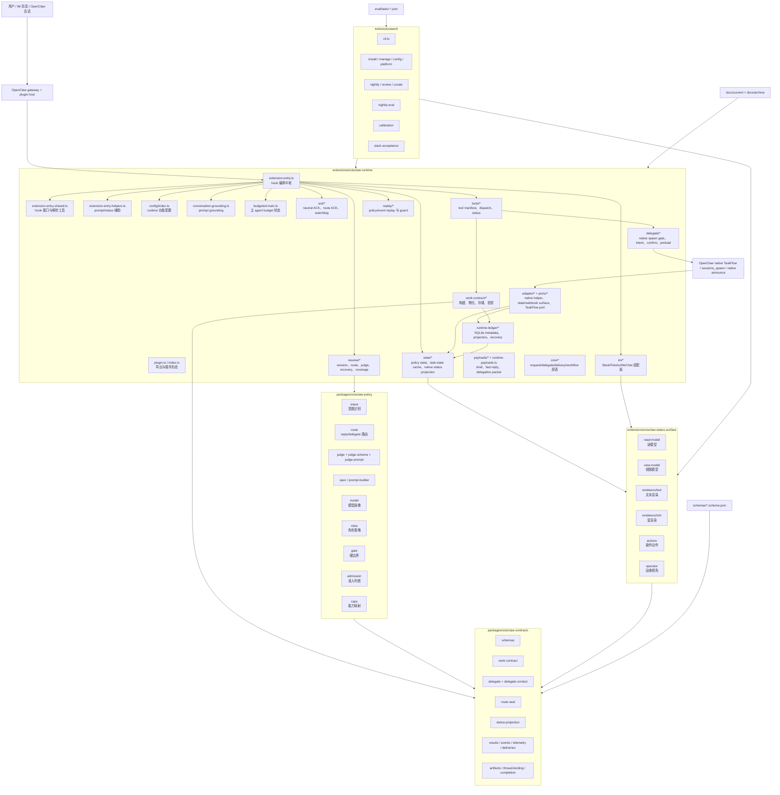
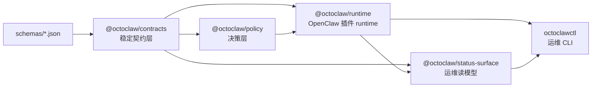
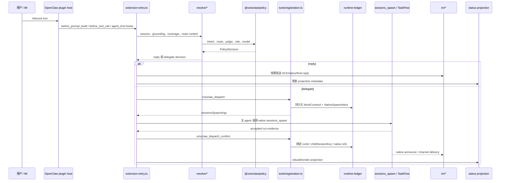
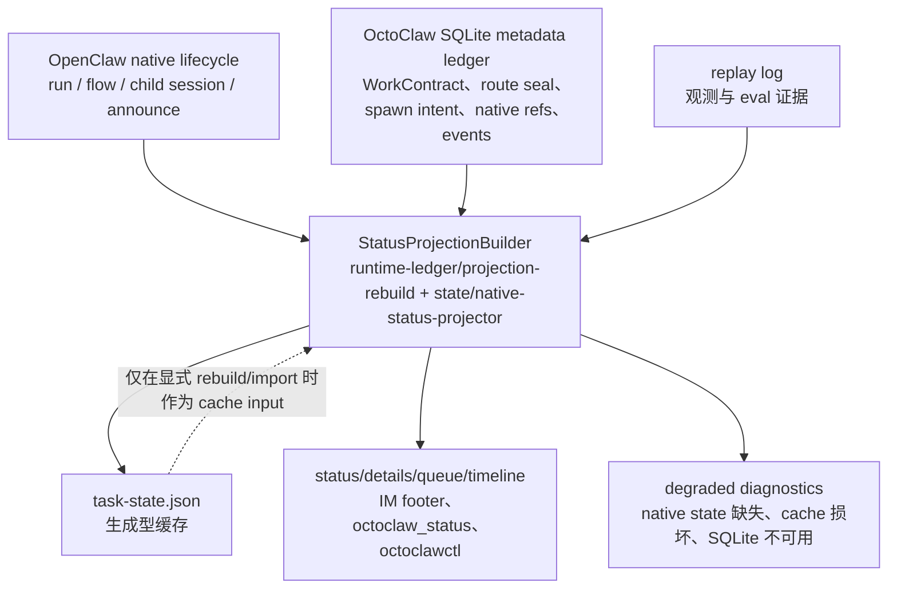
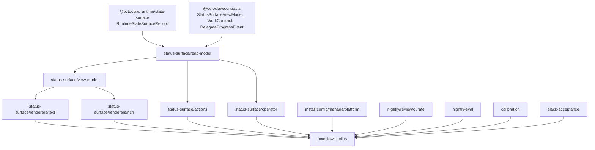

# OctoClaw 细架构图

日期：2026-05-09
分支：`v0.5.0`
状态：当前模块地图

本文档是当前 TypeScript-first OctoClaw 代码线的导航图。它配合
[`octoclaw-ts-rebuild-design-v2.md`](./octoclaw-ts-rebuild-design-v2.md)
和 runtime 收口清理计划一起看。

## 1. 系统总图



## 2. 包依赖方向



依赖规则：

- `contracts` 不能依赖 runtime、status 或 CLI。
- `policy` 可以依赖 `contracts`，但不能知道 IM 或 OpenClaw hook。
- `runtime` 可以依赖 `contracts` 和 `policy`，并负责 OpenClaw 插件接线。
- `status-surface` 消费 runtime state-surface 类型和 contract projection。
- `octoclawctl` 是运维客户端，不是 runtime 真相源。

## 3. Runtime Hook 流程



## 4. 真相源与投影



当前真相规则：

- Native TaskFlow 拥有执行生命周期真相。
- SQLite 拥有 OctoClaw metadata 和 audit facts。
- `task-state.json` 是可重建的生成型缓存。
- Replay 可以解释发生了什么，但不能创造执行真相。
- `task-state.json` 缺失或损坏时，应触发 rebuild 或 degraded status，不能被当成空任务列表。

## 5. Runtime 模块职责

| 模块 | 职责 |
|------|------|
| `extension-entry.ts` | 主 hook 编排中枢；串起 prompt、tool、ACK、IM、replay、state、native confirm 等行为。 |
| `extension-entry-shared.ts` | 共享 hook 接口、record coercion 和小型解析工具。 |
| `extension-entry-helpers.ts` | Prompt context 投影、delegate status 查询、reaction ACK 配置。 |
| `plugin.ts` / `index.ts` | 包导出和 OpenClaw 插件入口。 |
| `config/index.ts` | 功能配置：planner backend、speculative preload、ledger flags、ACK 设置。 |
| `resolve/session.ts` | Session 边界、state key、managed-agent context、policy metadata。 |
| `resolve/policy-resolver.ts` | 主策略解析：local rules、judge、route、role、model、coverage。 |
| `resolve/llm-judge.ts` | Judge context packet 和可选 LLM judge 调用。 |
| `resolve/route-seal.ts` | 构建和校验 route seal metadata。 |
| `resolve/runtime-recovery.ts` | Recovery 分类和 runtime 异常事实。 |
| `conversation-grounding.ts` | 从 durable status/projection facts 构建 prompt grounding。 |
| `budgeted-main.ts` | 主 agent budget escalation 状态。 |
| `ack/*` | Neutral ACK、route commit ACK、时序/去重、watchdog、transition notices。 |
| `delegate/native-spawn-intent.ts` | Native spawn intent 结构，以及 planner/confirm 握手数据。 |
| `delegate/native-spawn-gate.ts` | 执行前校验 native spawn/send gate。 |
| `delegate/native-spawn-confirm.ts` | 确认 accepted native spawn evidence。 |
| `delegate/speculative-preload.ts` | 可选的 0.5.1 planner preload hints。 |
| `tools/registration.ts` | Tool manifest 和 handler hub：route、dispatch、confirm、task action、status、recovery。 |
| `tools/dispatch-logic.ts` | 共享 dispatch 校验和 planner 逻辑。 |
| `tools/runtime-status.ts` | 生成 runtime status 输出。 |
| `work-contract/*` | WorkContract builder、materializer、continuity、native adapter、store、projector。 |
| `runtime-ledger/*` | SQLite migration、feature flag、projection rebuild、crash recovery、scheduler、shadow diff。 |
| `state/*` | Policy state cache、task-state cache、native status projector、retention。 |
| `im/*` | IM adapter interface、send path、Slack thread anchor、projection footer。 |
| `adapter/*` | Native helper bridge、runtime TaskFlow adapter、webhook/state surface。 |
| `ports/*` | TaskFlow port 抽象与 OpenClaw port adapter。 |
| `replay/*` | Replay append/read helper 和 message/tool guard。 |
| `payloads/*` | Delegation brief、materialization payload、fast reply packet。 |
| `core/*` | 更底层的 request/delegate/delivery/workflow 原语。 |

## 6. Policy 包职责

| 模块 | 职责 |
|------|------|
| `intent` | 意图分类辅助。 |
| `route` | Live route authority：只允许 `reply | delegate`。 |
| `judge` | Policy judge 输入/输出和协作模式辅助。 |
| `judge-schema` | Judge JSON schema 校验。 |
| `judge-prompt` | Judge prompt 拼装。 |
| `spec` | 规范化决策策略 spec 和 prompt builder。 |
| `model` | Model profile/backend 解析。 |
| `roles` | Policy role 选择。 |
| `gate` | 硬边界检查。 |
| `admission` | Scope/workspace 准入判断。 |
| `caps` | Worker pool / capability 映射。 |
| `compound` | 复合任务辅助。 |

## 7. Contracts 包职责

| 模块 | 职责 |
|------|------|
| `schemas` | Contract envelope 和共享 schema 常量。 |
| `work-contract` | WorkContract、delegate/reply contract、route metadata、coverage。 |
| `delegate` | Delegate task、attempt、progress、recovery、status packet。 |
| `delegate-context` | Handoff packet、artifact、budget report。 |
| `route-seal` | Route seal schema 和校验。 |
| `status-projection` | Task status projection builder contract。 |
| `deliveries` | Delivery envelope/receipt contract。 |
| `events` | Runtime event shape。 |
| `telemetry` | 优化 telemetry contract。 |
| `results` | Status surface result/view-model 类型。 |
| `artifacts` | Artifact reference 和 native-truth artifact kind。 |
| `thread-binding` | Thread/session binding metadata。 |
| `completion` | 历史 completion result contract；不是 planner 正常 runtime 协议。 |

## 8. Status Surface 与 CLI



CLI 职责：

- `install`、`deploy`、`enable`、`disable`、`status`：运维生命周期。
- `details`、`queue`、`timeline`、`patrol`、`repair`：status/operator surface。
- `nightly`、`review`、`curate`、`nightly-eval`、`promote`：反馈回路。
- `slack-acceptance`：有凭据时执行 live IM acceptance harness。
- `calibration`：校准 gate 和报告。

## 9. 已删除的旧路径

当前代码线不能依赖这些路径：

| 旧路径 | 当前替代 |
|--------|----------|
| `octoclaw_spawn` public tool | `octoclaw_dispatch` + native `sessions_spawn` + `octoclaw_dispatch_confirm` |
| plugin `runtime.subagent.run()` fallback | native planner/confirm path |
| fake detached runtime | host 没有真实 native runtime 时 fail closed |
| child completion file 作为最终协议 | OpenClaw native announce/channel delivery |
| child-finalizer recovery loop | native lifecycle + projection/recovery diagnostics |
| 新 runtime 的 JSON delivery outbox | native delivery metadata + replay/projection |
| task-state 作为 durable truth | SQLite metadata ledger + native lifecycle |

## 10. 高风险文件

这些文件是真正的热点，应该谨慎拆分，不能随手大改：

| 文件 | 风险 |
|------|------|
| `extensions/octoclaw-runtime/src/extension-entry.ts` | Hook 编排范围很广，改动可能影响 ACK、dispatch、prompt、IM 和 replay。 |
| `extensions/octoclaw-runtime/src/tools/registration.ts` | Tool manifest 和 handler hub，改动会影响用户可见工具行为。 |
| `extensions/octoclaw-runtime/src/resolve/policy-resolver.ts` | Policy/judge/model route 行为。 |
| `extensions/octoclaw-runtime/src/work-contract/store.ts` | Metadata truth 读写路径。 |
| `extensions/octoclaw-runtime/src/runtime-ledger/index.ts` | SQLite schema 和 migration。 |
| `tools/octoclawctl/src/cli.ts` | 运维命令入口。 |

## 11. 审计命令

```bash
pnpm check
pnpm test
git diff --check
rg "octoclaw_spawn|runtime\\.subagent\\.run|child-finalizer|flushDeliveryOutbox|appendToDeliveryOutbox" extensions/octoclaw-runtime/src
rg "v1\\.5\\.0|0\\.1\\.0|0\\.3\\.0" README.md README.zh-CN.md version.txt packages extensions tools
```
