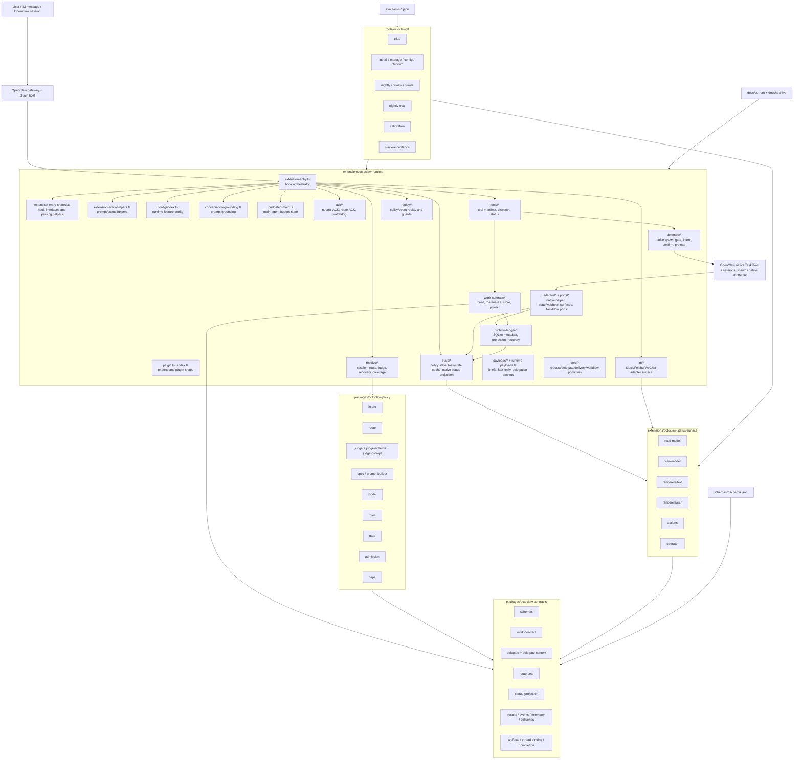
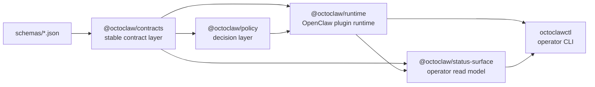
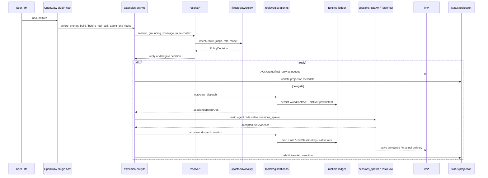
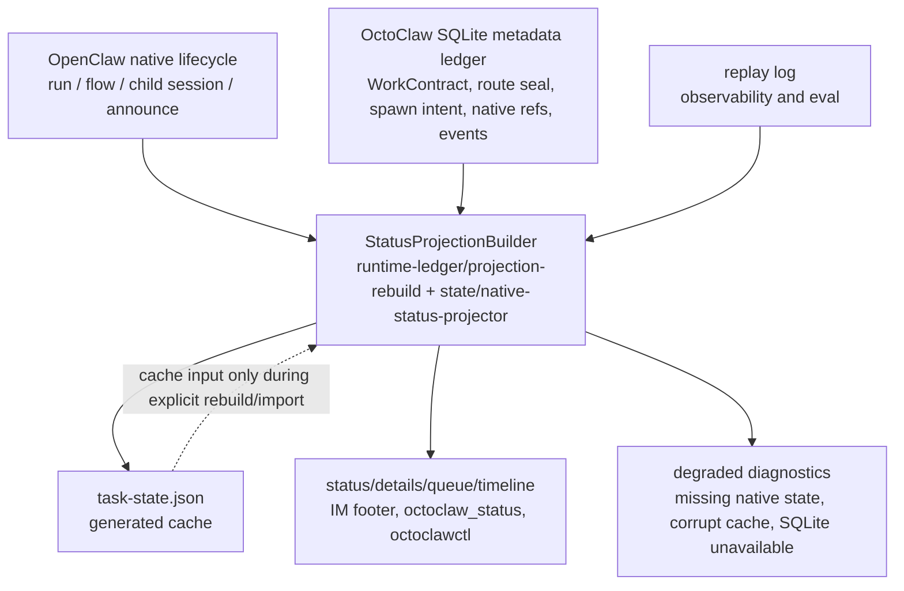

# OctoClaw Architecture Map

Date: 2026-05-09
Branch: `v0.5.0`
Status: current module map

This document is a navigational map of the current TypeScript-first OctoClaw
line. It complements
[`octoclaw-ts-rebuild-design-v2.md`](./octoclaw-ts-rebuild-design-v2.md) and
the runtime cleanup plan.

## 1. System Map



## 2. Package Dependency Direction



Rules:

- `contracts` must not depend on runtime, status, or CLI.
- `policy` can depend on `contracts`; it must not know IM or OpenClaw hooks.
- `runtime` may depend on `contracts` and `policy`; it owns OpenClaw plugin wiring.
- `status-surface` consumes runtime state-surface types and contract projections.
- `octoclawctl` is an operator client, not a runtime truth source.

## 3. Runtime Hook Flow



## 4. Truth And Projection



Current truth rules:

- Native TaskFlow owns execution lifecycle.
- SQLite owns OctoClaw metadata and audit facts.
- `task-state.json` is generated and rebuildable.
- Replay can explain what happened; it cannot create execution truth.
- Missing/corrupt task-state should produce rebuild or degraded status, not an
  empty task list.

## 5. Runtime Module Responsibilities

| Module | Responsibility |
|--------|----------------|
| `extension-entry.ts` | Main hook orchestrator; wires prompt, tool, ACK, IM, replay, state, and native confirm behavior. |
| `extension-entry-shared.ts` | Shared hook interfaces, record coercion, and small parsing helpers. |
| `extension-entry-helpers.ts` | Prompt context projection, delegate status queries, reaction ACK config. |
| `plugin.ts` / `index.ts` | Package export and OpenClaw plugin entry. |
| `config/index.ts` | Feature config: planner backend, speculative preload, ledger flags, ACK settings. |
| `resolve/session.ts` | Session boundaries, state keys, managed-agent context, policy metadata. |
| `resolve/policy-resolver.ts` | Main policy resolution: local rules, judge, route, role, model, coverage. |
| `resolve/llm-judge.ts` | Judge context packet and optional LLM judge call. |
| `resolve/route-seal.ts` | Builds/verifies route seal metadata. |
| `resolve/runtime-recovery.ts` | Recovery classification and runtime anomaly facts. |
| `conversation-grounding.ts` | Builds prompt grounding from durable status/projection facts. |
| `budgeted-main.ts` | Budgeted main-agent escalation state. |
| `ack/*` | Neutral ACK, route commit ACK, timing/dedupe, watchdog, transition notices. |
| `delegate/native-spawn-intent.ts` | Native spawn intent shape and planner/confirm handshake data. |
| `delegate/native-spawn-gate.ts` | Validates native spawn/send gates before execution. |
| `delegate/native-spawn-confirm.ts` | Confirms accepted native spawn evidence. |
| `delegate/speculative-preload.ts` | Optional 0.5.1 planner preload hints. |
| `tools/registration.ts` | Tool manifest and handlers: route, dispatch, confirm, task action, status, recovery. |
| `tools/dispatch-logic.ts` | Shared dispatch validation and planner logic. |
| `tools/runtime-status.ts` | Builds runtime status output. |
| `work-contract/*` | WorkContract builders, materializer, continuity, native adapter, store, projectors. |
| `runtime-ledger/*` | SQLite migrations, feature flags, projection rebuild, crash recovery, scheduler, shadow diff. |
| `state/*` | Policy state cache, task-state cache, native status projector, retention. |
| `im/*` | IM adapter interface, send path, Slack thread anchor, projection footer. |
| `adapter/*` | Native helper bridge, runtime TaskFlow adapter, webhook/state surfaces. |
| `ports/*` | TaskFlow port abstractions and OpenClaw port adapters. |
| `replay/*` | Replay append/read helpers and message/tool guards. |
| `payloads/*` | Delegation briefs, materialization payloads, fast reply packets. |
| `core/*` | Lower-level request/delegate/delivery/workflow primitives. |

## 6. Policy Package Responsibilities

| Module | Responsibility |
|--------|----------------|
| `intent` | Intent classification helpers. |
| `route` | Live route authority: `reply | delegate`. |
| `judge` | Policy judge input/output and coordination mode helpers. |
| `judge-schema` | Judge JSON schema validation. |
| `judge-prompt` | Judge prompt assembly. |
| `spec` | Canonical decision policy spec and prompt builder. |
| `model` | Model profile/backend resolution. |
| `roles` | Policy role selection. |
| `gate` | Hard boundary checks. |
| `admission` | Scope/workspace admission decisions. |
| `caps` | Worker pool / capability mapping. |
| `compound` | Compound task helpers. |

## 7. Contract Package Responsibilities

| Module | Responsibility |
|--------|----------------|
| `schemas` | Contract envelope and shared schema constants. |
| `work-contract` | WorkContract, delegate/reply contracts, route metadata, coverage. |
| `delegate` | Delegate task, attempt, progress, recovery, status packets. |
| `delegate-context` | Handoff packets, artifacts, budget reports. |
| `route-seal` | Route seal schema and validation. |
| `status-projection` | Task status projection builder contracts. |
| `deliveries` | Delivery envelope/receipt contracts. |
| `events` | Runtime event shapes. |
| `telemetry` | Optimization telemetry contracts. |
| `results` | Status surface result/view-model types. |
| `artifacts` | Artifact references and native-truth artifact kinds. |
| `thread-binding` | Thread/session binding metadata. |
| `completion` | Historical completion result contract; not normal planner runtime. |

## 8. Status Surface And CLI


CLI responsibilities:

- `install`, `deploy`, `enable`, `disable`, `status`: operator lifecycle.
- `details`, `queue`, `timeline`, `patrol`, `repair`: status/operator surface.
- `nightly`, `review`, `curate`, `nightly-eval`, `promote`: feedback loop.
- `slack-acceptance`: live IM acceptance harness when credentials exist.
- `calibration`: calibration gates and reports.

## 9. Removed Legacy Paths

The current line must not depend on these paths:

| Legacy path | Current replacement |
|-------------|---------------------|
| `octoclaw_spawn` public tool | `octoclaw_dispatch` + native `sessions_spawn` + `octoclaw_dispatch_confirm` |
| plugin `runtime.subagent.run()` fallback | native planner/confirm path |
| fake detached runtime | fail closed if host has no real native runtime |
| child completion file as final protocol | OpenClaw native announce/channel delivery |
| child-finalizer recovery loop | native lifecycle + projection/recovery diagnostics |
| JSON delivery outbox for new runtime | native delivery metadata + replay/projection |
| task-state as durable truth | SQLite metadata ledger + native lifecycle |

## 10. High-Risk Files

These files are legitimate hotspots and should be split carefully, not casually
rewritten:

| File | Risk |
|------|------|
| `extensions/octoclaw-runtime/src/extension-entry.ts` | Very broad hook orchestration; changes can affect ACK, dispatch, prompt, IM, and replay. |
| `extensions/octoclaw-runtime/src/tools/registration.ts` | Tool manifest and handler hub; changes can alter user-visible tool behavior. |
| `extensions/octoclaw-runtime/src/resolve/policy-resolver.ts` | Policy/judge/model route behavior. |
| `extensions/octoclaw-runtime/src/work-contract/store.ts` | Metadata truth read/write path. |
| `extensions/octoclaw-runtime/src/runtime-ledger/index.ts` | SQLite schema and migrations. |
| `tools/octoclawctl/src/cli.ts` | Operator command entry. |

## 11. Audit Commands

```bash
pnpm check
pnpm test
git diff --check
rg "octoclaw_spawn|runtime\\.subagent\\.run|child-finalizer|flushDeliveryOutbox|appendToDeliveryOutbox" extensions/octoclaw-runtime/src
rg "v1\\.5\\.0|0\\.1\\.0|0\\.3\\.0" README.md README.zh-CN.md version.txt packages extensions tools
```
