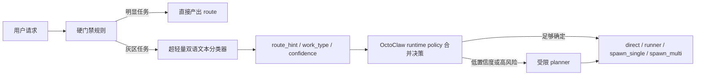

# OctoClaw 灰区路由设计 v1 (2026-03-27)

## 1. 文档目的

这份文档专门回答一个问题：

> **在不拖慢主链路、不频繁切主模型、不引入重型本地模型的前提下，OctoClaw 怎么做“灰区任务”分诊？**

这里的“灰区任务”指：

- 仅靠硬规则不够稳
- 但又不值得直接让主模型或 planner 深度思考
- 需要在 `direct / runner / spawn_single / spawn_multi` 之间做快速分流

本设计是主产品文档的补充，默认与
[octoclaw-product-design-v2-2026-03-27.md](/Users/guanzhicheng/Documents/Playground/openclaw-projects/openclaw-octopus/octoclaw-product-design-v2-2026-03-27.md)
保持一致。

---

## 2. 先给结论

OctoClaw 的灰区路由不应一开始就依赖：

- 远程便宜模型
- 本地 embedding 大模型
- 本地小 LLM judge

第一版最稳的路线是：

1. **硬门禁规则**
2. **超轻量双语文本分类器**
3. **低置信度再进入受限 planner**

也就是说：

> **主链路前置分诊必须极快；真正更智能的拆分只在确定 delegate 之后发生。**

---

## 3. 为什么不能把灰区都交给 LLM

### 3.1 远程小模型不适合主链路前置

即使模型便宜，只要它在网络另一端，主链路就会遇到：

- 首 token 延迟
- provider 抖动
- 套餐/账号波动
- prompt 漂移

这会直接伤害 OctoClaw 最核心的目标：

- 快响应
- 主 agent 不阻塞

### 3.2 本地小 LLM 也不是第一优先级

本地小 LLM judge 的问题是：

- 资源占用仍明显高于传统分类器
- 结构化输出稳定性仍需额外约束
- 对“有限标签分类”来说，常常是过度设计

所以第一版灰区路由不该直接走“小 LLM 判断一切”。

---

## 4. 灰区任务到底是什么

以下不是灰区：

- 明显闲聊、解释、翻译、短问答
- 明显 shell/status/logs/file-read
- 明显多文件重构、长调研、复杂写作

以下才算灰区：

- 像是分析，但不确定该直接答还是先查状态
- 像是代码问题，但不确定该先 runner 还是直接 subagent
- 像是研究/写作，但复杂度还没高到一定要 `spawn_multi`
- 输入混合了中文需求、英文报错、shell、路径、repo 名称

OctoClaw 的灰区层只负责：

- 给出 `route_hint`
- 给出 `work_type`
- 给出 `review_required`
- 给出 `confidence`

灰区层**不负责**真正执行任务。

---

## 5. 总体架构



原则：

- **硬门禁先切掉明显任务**
- **分类器只处理剩余灰区**
- **planner 只处理低置信度或高风险灰区**

---

## 6. 第一版推荐实现

### 6.1 推荐：超轻量双语文本分类器

第一版优先使用：

- `char n-gram`
- `word n-gram`
- `LogisticRegression` / `LinearSVC` / `SGDClassifier`

这是一个非常传统但非常实用的方案：

- CPU 即可
- 不需要 GPU
- 模型体积小
- 推理毫秒级
- 对中英混输、命令、路径、错误日志都比较友好

这里的“双语”不是说模型天然理解世界，而是：

- 中文、英文、代码、命令都以统一文本特征进入分类器
- `char n-gram` 对中文尤其有效
- 不依赖复杂分词

### 6.2 为什么不是 embedding 起步

embedding 路线以后可以上，但第一版不是最优：

- 资源更高
- 部署更重
- 前置收益未必大于复杂度

OctoClaw 第一版更适合先验证：

- 灰区样本能不能被传统分类稳定吃掉
- 低资源路线能不能把主链路分诊做好

---

## 7. 标签与输出

### 7.1 最小标签集

第一版建议只预测这些字段：

- `route_hint`
  - `direct`
  - `runner`
  - `spawn_single`
  - `spawn_multi`
- `work_type`
  - `ops`
  - `research`
  - `code`
  - `review`
- `review_required`
  - `true / false`

### 7.2 输出 schema

```json
{
  "route_hint": "spawn_single",
  "work_type": "code",
  "review_required": true,
  "confidence": 0.82,
  "margin": 0.17,
  "classifier_name": "grayzone_ngram_lr_v1"
}
```

这里：

- `confidence` 表示最高类别概率
- `margin` 表示第一名和第二名之间的差距

---

## 8. 什么叫“低置信度”

第一版建议定义：

- `confidence < 0.80`
或
- `margin < 0.15`

就认为是灰区未定案。

这时不直接信分类器，而进入：

- 更保守的 delegate 策略
或
- 受限 planner

也就是说：

> **分类器不是总指挥，只是灰区建议器。**

---

## 9. 硬门禁与分类器怎么配合

### 9.1 硬门禁负责什么

硬门禁负责切掉最明显的任务，例如：

- 明显 shell/status/logs/file-read -> `runner`
- 明显短答/聊天/解释 -> `direct`
- 明显多文件/长研究/复杂重构 -> 非 `direct`
- 明显高风险 -> `review_required = true`

### 9.2 分类器负责什么

分类器只负责硬门禁不确定的那些请求。

这样做的好处：

- 大部分请求零额外模型负担
- 只有少数灰区走分类器
- 分类器压力和常驻资源都更小

---

## 10. 为什么主模型不要频繁切

主模型/leader model 应该尽量稳定。

原因：

- prompt cache 更稳
- 会话风格不漂
- 主脑智商不抖
- 首响行为更稳定

所以：

- **主模型稳定**
- **灰区分类器独立**
- **worker 模型按需切**

这意味着灰区层不应建立在“先叫远程模型想一轮”上。

---

## 11. 未来升级路线

### Phase A

先上：

- 硬门禁规则
- n-gram + 线性分类器

### Phase B

如果发现传统分类器对灰区上限不够，再升级到：

- `fastText`
- `SetFit`
- embedding classifier

### Phase C

如果还不够，再考虑：

- 本地小 LLM judge

但这一步默认不应在第一版完成前出现。

---

## 12. 与 runtime policy 的关系

灰区分类器不是单独系统，而应作为 `runtime policy` 的一个可插拔 adapter：

- 硬门禁先跑
- 进入灰区时调用 classifier
- classifier 输出结构化建议
- runtime policy 再结合：
  - risk
  - context growth
  - budget
  - review gate
  - current runtime health

做最终决策

最终拍板仍是 OctoClaw policy，而不是分类器。

---

## 13. 当前不采用的方向

当前不采用：

- 远程便宜模型前置分诊
- 一上来就上本地 embedding 大模型
- 一上来就上本地小 LLM judge
- 让主模型自己自由决定灰区去向

原因很简单：

- 不够快
- 不够稳
- 不够省资源

---

## 14. 推荐顺序

最推荐的实现顺序：

1. 把灰区路由写入主产品设计和 runtime policy 边界
2. 先实现硬门禁特征表
3. 再实现超轻量分类器 MVP
4. 再定义低置信度进入 planner 的规则
5. 最后再评估是否值得升级到 embedding / SetFit / 本地小 LLM

---

## 15. 一句话总结

> **OctoClaw 的灰区路由第一版，最适合走“硬门禁 + 超轻量双语文本分类器 + 低置信度再进入受限 planner”这条路。**

这条路最符合 OctoClaw 的原始诉求：

- 快响应
- 降本
- 主 agent 不阻塞
- 多 Agent 按需分配

---

## 16. 参考

- [fastText 官网](https://fasttext.cc/)
- [fastText 文本分类教程](https://fasttext.cc/docs/en/supervised-tutorial.html)
- [SetFit 文档](https://huggingface.co/docs/setfit/en/index)
- [NadirClaw 官网](https://getnadir.com/)
- [How I Cut My LLM Costs 60% With a Local Router](https://dev.to/dor_amir_dbb52baafff7ca5b/how-i-cut-my-llm-costs-60-with-a-local-router-open-source-56k0)
