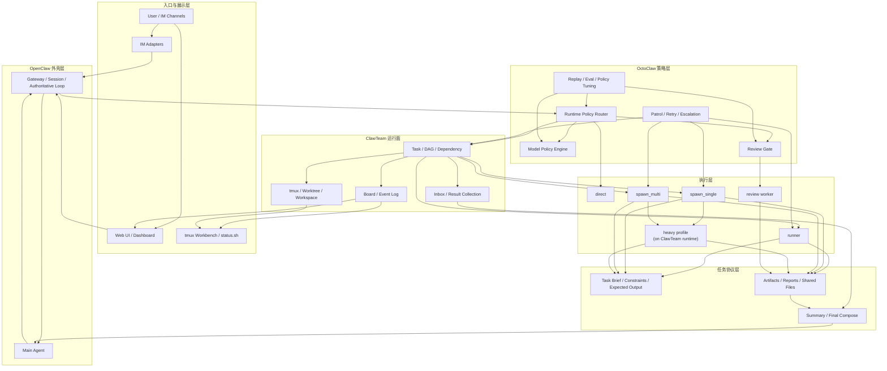

# OctoClaw 产品设计与重构方案 v2 (2026-03-27)

## 1. 文档目的

这份文档不是“借鉴分析”，而是 **OctoClaw 自己的产品设计文档**。

目标是把下面几件事一次写清楚：

- OctoClaw 到底是什么产品
- 它和 OpenClaw、ClawTeam 的边界怎么分
- 为什么要重构，以及重构后长什么样
- 现有 agent 类型要不要改，怎么改
- 接下来按什么步骤实现，风险最小、收益最大

这份文档应作为后续实现的 **canonical design**。

---

## 2. 产品定义

### 2.1 一句话定义

> **OctoClaw 是 OpenClaw 的多 Agent 调度脑、成本脑和展示脑。**

它不应该变成：

- 又一个通用 agent framework
- 又一个模型网关
- 又一个纯任务看板

它应该专注做三件事：

1. **按需分配执行面**
2. **按需分配模型和成本**
3. **把多 Agent 执行过程展示清楚**

### 2.2 产品定位

OctoClaw 的目标不是“会开很多 agent”，而是：

- 主 agent 更快响应
- 子任务更稳定地下沉
- 多 Agent 协作更可控、更可解释
- 复杂任务在不炸上下文和不炸成本的前提下被拆开处理

换句话说：

> **OctoClaw 不是 worker 本身，而是 worker 的调度系统。**

### 2.3 产品方法论

OctoClaw 的方法论不是“造一个更大的 Agent 框架”，而是把多 Agent 的关键工程能力收敛成一套可控、可解释、可运维的系统。

它的核心方法论应该明确成下面几条。

#### 2.3.1 workflow-first，agent-second

默认先问：

- 这件事能不能在当前链路同步完成
- 能不能交给边界清楚的 runner workflow
- 是否真的需要独立 worker
- 是否真的值得多 worker 协调

也就是说：

- 先做清晰 workflow
- 再按需上 agent
- 多 agent 不是默认答案

#### 2.3.2 policy-first，而不是 prompt-first

委派、review、选模、执行面切换，必须首先是系统行为。

模型可以辅助判断，但不能变成唯一裁决者。

这意味着 OctoClaw 的核心是：

- runtime policy
- route / dispatch
- model policy
- review gate
- explainable decision

而不是依赖主脑“记不记得该派任务”。

#### 2.3.3 context-engineered harness

OctoClaw 应该把 context engineering 当成产品主线，而不是 prompt 微调。

真正重要的是：

- brief 里放什么
- summary 回什么
- 什么进入主链
- 什么落 artifact
- follow-up 时带什么 compact context

所以 OctoClaw 的默认 harness 应该服务于：

- 降低主上下文膨胀
- 让长任务跨 session 也能续上
- 让委派结果可回收、可复用、可检索

#### 2.3.4 light by default，heavy on demand

OctoClaw 可以借鉴 harness engineering，但不能默认把所有任务做成重型 runtime。

默认全局启用的应该是 lightweight harness：

- runtime policy
- route / dispatch
- brief / summary / artifact
- review gate
- task / inbox / board
- explainable decision

heavy protocol 只在复杂任务上叠加，例如：

- checkpoint summary
- 更强的 artifact-first 约束
- 更长 timeout
- 更严格的 review / merge gate
- 更强的多 worker 协作协议

所以正确方向不是：

- “所有请求都上重型 harness”

而是：

> **先用轻量 harness 提升效率和降本，再按需叠加重型执行协议。**

#### 2.3.5 artifact-first，event-first，state-first

OctoClaw 不应把执行真相藏在聊天 transcript 和主脑记忆里。

真正的一等公民应该是：

- task state
- delegated event stream
- artifacts
- thread/session continuity
- review and delivery readiness

长结果、日志、diff、研究材料优先落 artifact；
执行过程优先落 event；
状态优先落结构化 truth，而不是让外层展示面临时猜。

#### 2.3.6 observable and evaluable by default

OctoClaw 不只是调度，还要能解释、回放、评估和复盘。

所以默认就应该有：

- replay
- route/model/review reasons
- patrol and failure surfaces
- state-machine visibility
- small eval loops

没有这些，系统只会越来越复杂，不会越来越稳。

### 2.4 借鉴来源与边界

OctoClaw 的设计确实参考了外部系统，但借的是工程方法，不是整套产品形态。

#### 2.4.1 Anthropic：借方法论，不借产品壳

Anthropic 官方文章和 Claude Cookbooks 给 OctoClaw 的主要启发是：

- `workflow-first`
- `context engineering`
- `tool ergonomics`
- `long-running harness`
- `eval / postmortem discipline`

最关键的参考包括：

- [Building effective agents](https://www.anthropic.com/engineering/building-effective-agents)
- [Effective context engineering for AI agents](https://www.anthropic.com/engineering/effective-context-engineering-for-ai-agents)
- [How we built our multi-agent research system](https://www.anthropic.com/engineering/multi-agent-research-system)
- [Effective harnesses for long-running agents](https://www.anthropic.com/engineering/effective-harnesses-for-long-running-agents)
- [Writing effective tools for agents](https://www.anthropic.com/engineering/writing-tools-for-agents)
- [Demystifying evals for AI agents](https://www.anthropic.com/engineering/demystifying-evals-for-ai-agents)
- [Claude Cookbooks](https://platform.claude.com/cookbooks)

Anthropic 对 OctoClaw 的真正影响应该是：

- 让 OctoClaw 更像一个可靠 harness
- 而不是让 OctoClaw 变成另一个“通用 agent SDK”

#### 2.4.2 DeerFlow：借显式状态、事件、artifact 思想

DeerFlow 最值得借的是：

- explicit thread state
- delegated event stream
- artifact-first delivery
- thread/topic binding
- todo persistence across context loss

但不应照搬：

- 整套 LangGraph 栈
- DeerFlow 自己的完整产品边界

DeerFlow 对 OctoClaw 的价值，是帮助它把 runtime truth 做硬。

#### 2.4.3 ClawTeam：借运行面，不借策略脑

ClawTeam 最值得借的是：

- task truth
- spawn liveness
- session persistence
- board / inbox / tmux workbench

但不应让 ClawTeam 反过来主导：

- route
- model policy
- review policy
- budget policy

所以结论很简单：

> **ClawTeam 是运行面，DeerFlow 是状态/事件参考，Anthropic 是方法论来源，而 OctoClaw 自己负责把它们产品化。**

相关笔记见：

- [octoclaw-anthropic-agent-engineering-notes-v1-2026-03-30.md](/Users/guanzhicheng/Documents/Playground/openclaw-projects/openclaw-octopus/octoclaw-anthropic-agent-engineering-notes-v1-2026-03-30.md)
- [octoclaw-clawteam-deerflow-source-notes-v1-2026-03-29.md](/Users/guanzhicheng/Documents/Playground/openclaw-projects/openclaw-octopus/octoclaw-clawteam-deerflow-source-notes-v1-2026-03-29.md)

---

## 3. 产品目标

### 3.1 主要目标

#### 1. 快响应

- 主 agent 不被慢工具、长检索、长命令阻塞
- 用户尽快收到首响
- 长任务自动转后台继续执行

#### 2. 低成本

- 简单任务不浪费强模型
- 轻工具任务优先 runner
- 子 agent 只拿最小 brief
- 长结果优先 artifact 化

#### 3. 稳定委派

- 委派是系统行为，不是 prompt 习惯
- 子任务状态和交付物是一等公民
- 主 agent 不再靠“想起来”才派单

#### 4. 多 Agent 协作可观察

- 能看到谁在做什么
- 能看到为什么这么路由
- 能看到结果、风险、重试和升级链

#### 5. 多 IM / UI 适配

- 不只在终端里能看
- 不只在飞书里能看
- 同一个任务在不同 IM 里能用最合适的交互方式呈现

### 3.2 非目标

当前阶段不追求：

- 自己造一套全新的大模型网关
- 自己造一套通用多 Agent 框架
- 让 LLM 完全自由决定是否委派
- 为所有复杂任务单独造一套独立 heavy runtime

---

## 4. 设计原则

### 4.1 系统控制边界，模型做局部优化

模型可以辅助判断，但不能独自决定：

- 是否委派
- 委派给谁
- 是否 review
- 是否升级成本

### 4.2 统一运行面，分离执行语义

所有非 `direct` 工作都收敛到统一运行面；
不同的是执行协议，而不是再造多套 runtime。

### 4.2.1 轻量 harness 默认开启

默认应全局开启的能力：

- runtime policy decision
- task / inbox / board 基础协作面
- brief / summary / artifact 协议
- default skill bundle
- explainable route / review reasons

这些能力应该服务于：

- 更快首响
- 更低 token 消耗
- 更稳定委派

而不是把所有任务都升级成复杂长流程。

### 4.3 brief 输入，summary 输出

子任务默认只吃最小任务包：

- goal
- constraints
- expected output
- 必要 artifact refs

主链路默认只回收：

- summary
- status
- artifacts
- next step

### 4.4 artifact first

长结果、日志、草稿、diff、研究材料优先落文件；
主链路不默认吞下完整 transcript。

### 4.5 可解释优先

每一次关键决策都应该能回答：

- 为什么不是 direct
- 为什么不是 runner
- 为什么用了这个模型
- 为什么开了 review
- 为什么升级/重试

---

## 5. 最终产品形态

### 5.1 四层结构

#### 1. OpenClaw 外壳层

负责：

- session
- authoritative loop
- workspace
- channel / user interaction shell

#### 2. OctoClaw 策略层

负责：

- route
- model / profile resolution
- cost / budget / quota policy
- review gate
- patrol / retry / escalation
- final compose policy

#### 3. ClawTeam 运行面

负责：

- task
- inbox
- board
- tmux
- worktree / workspace isolation
- worker observability

#### 4. 执行层

负责真正执行：

- `direct`
- `runner`
- `spawn_single`
- `spawn_multi`

其中复杂任务不是进入独立的新 runtime，而是：

> **在 ClawTeam 运行面上启用更重的 heavy profile / protocol。**

### 5.2 总体架构图



---

## 6. 关键运行机制

### 6.1 route 收敛

最终 route 只保留 4 类：

- `direct`
- `runner`
- `spawn_single`
- `spawn_multi`

说明：

- `heavy` 不再是独立 route
- 它是 `spawn_single / spawn_multi` 上的一种执行协议增强

但这 4 条 lane 不应再被理解为“任务语义标签”。

更准确的说法是：

> **route 是执行合同选择，不是任务分类结果。**

也就是说，OctoClaw 不该主要问：

- 这句话像不像研究任务
- 这句话像不像代码任务

而应该主要问：

- 这件事是否能在当前主链同步完成
- 这件事是否是边界清楚的工具工作流
- 这件事是否需要独立上下文和独立交付物
- 这件事是否真的值得多 worker 协调

### 6.1.1 `work_contract` 应成为 route 的正交维度

建议在 route 之外，再维护一个更稳定的执行合同维度，例如：

- `answer_now`
- `inspect_report`
- `deliverable_work`
- `coordinated_work`

它不是给用户看的新 route，而是给系统自己看的决策中间层。

这样可以减少很多灰区误判：

- `direct` 对应 `answer_now`
- `runner` 对应 `inspect_report`
- `spawn_single` 对应 `deliverable_work`
- `spawn_multi` 对应 `coordinated_work`

### 6.1.2 route 的推荐判定顺序

推荐顺序应是：

1. 先看 continuity
   - 当前 session/thread 是否已有任务
   - sticky lane 是否应复用
   - 是否已有 artifact/checklist/checkpoint
2. 再判是否满足 `direct` 合同
3. 再判是否满足 `runner` 合同
4. 其余默认进入 `spawn_single`
5. 只有明确可并行或必须分阶段时才进入 `spawn_multi`

这比“先做任务语义分类，再猜 route”更稳。

### 6.2 `direct` 的定位

`direct` 不应表示“主脑先试试看能不能做”。

它应只表示：

- 当前上下文内可同步完成
- 不需要 durable runtime
- 不需要独立 artifact 流
- 不需要长时间工具链
- 不需要 checkpoint / 恢复 / review

一句话：

> **`direct = answer-now lane`。**

### 6.3 runner 的定位

`runner` 不是普通 subagent，而是 **特殊 executor**。

它的特点：

- 常驻 daemon
- 每个 job 独立 fresh shell
- 任务快、便宜、稳定
- tmux 里占一个固定服务工位

它解决的是：

- 轻工具任务不要过度 agent 化
- 避免每次都 spawn 一个真正 agent session

但更精确的定义应该是：

- 边界清楚的工具工作流
- 低歧义
- 低上下文依赖
- 最好有 playbook 或程序化步骤
- 输出偏状态、检查结果、执行结果、收集报告

一句话：

> **`runner = bounded tool workflow`，而不是“轻量子 agent”。**

### 6.4 spawn_single 的定位

用于：

- 中等复杂度任务
- 单个 worker 足够完成
- 需要隔离上下文
- 但不需要团队 DAG

默认特征：

- 一个 task
- 一个 worker
- 一个 tmux 工位
- 一个 summary / artifact 回传

在经过 Anthropic 官方方法论校准后，`spawn_single` 应被视为：

> **默认 delegated lane。**

只要满足任一条件，就应优先走 `spawn_single`：

- 需要独立上下文
- 需要 synthesis / writing / coding judgment
- 需要 durable artifact
- 可能跨多个 context window
- 结果不是简单状态，而是交付物

### 6.5 spawn_multi 的定位

用于：

- 多步骤
- 可并行
- 有依赖
- 需要 planner / worker / reviewer 协作

默认特征：

- task graph
- DAG / dependency
- 多个 worker
- board / inbox / tmux 可观察

但 `spawn_multi` 不应因为“任务复杂”就触发。

它只应在这两类场景开启：

- 真正存在并行收益
- 明确需要 planner / worker / review 这种分阶段协作

也就是说：

> **复杂但高耦合的任务，通常仍应先走 `spawn_single`。**

### 6.6 heavy profile 的定位

heavy profile 不是新 runtime，而是：

- 更强的 brief schema
- 更长超时
- 更严格的 summary / artifact-first 约束
- 更强的 review / merge gate
- 可选独立 workspace / sandbox

只对这类任务启用：

- 长任务
- 多步研究
- sandbox-heavy
- intermediate artifacts 很多
- recursive exploration 倾向明显

---

## 7. OctoClaw 的核心护城河

OctoClaw 需要有自己的独特价值，不能只是“把 ClawTeam 接进来了”。

我建议把护城河明确成 5 件事。

### 7.1 自动选模型 + 自动选执行面

这是最该做成名片的能力。

不是简单选模型，而是联合决定：

- route
- role / phase
- model / profile
- 是否 review
- 是否启用 heavy profile

并且 route 的判定语义需要从“任务像什么”进一步收紧成“执行合同是什么”。

决策输入至少包括：

- task shape
- work contract
- latency sensitivity
- risk
- context growth
- parallel gain
- budget pressure
- quota state
- runtime health
- replay/eval feedback

#### 7.1.1 选模内核应保持可插拔

短期不必单独开源，但必须按“未来可拆出去单独开源”的方式设计。

核心原则：

- 选模内核本身不感知 OpenClaw / ClawTeam
- 输出结构化 decision object，而不是只输出一个 model id
- runtime bridge 才负责把 decision 翻译给 OpenClaw / ClawTeam

推荐结构：

- `catalog adapters`
- `benchmark adapters`
- `economics adapters`
- `policy engine`
- `runtime bridges`

#### 7.1.3 旧选模与旧角色推断的拆除路线

当前外层 runtime 与 route/policy 已经进入新架构，但选模、legacy label、task truth model 仍带有明显旧内核。

单独拆除路线见：

- [octoclaw-legacy-core-removal-roadmap-v1-2026-03-29.md](/Users/guanzhicheng/Documents/Playground/openclaw-projects/openclaw-octopus/octoclaw-legacy-core-removal-roadmap-v1-2026-03-29.md)

#### 7.1.2 选模内核的输入输出

输入应该包括：

- task shape / work type / phase
- work contract
- risk
- latency target
- context budget
- available model set
- benchmark snapshot
- quota health

主链选模还应明确一条额外原则：

> **main lane 必须走能力门槛，不应被单纯的价格或 TTFT 拉低。**

这意味着：

- 不再靠硬白名单
- 也不再让中档模型自由竞争主链
- 而是先过 `capability floor`，再在合格模型里比较健康度、延迟和成本
- internal effective cost
- market price baseline

输出不应只是：

- `model=xxx`

而应是：

```json
{
  "decision": {
    "selected_model": "provider/model",
    "profile": "writer-fast",
    "reasoning_effort": "medium",
    "route_class": "spawn_single",
    "protocol": "normal",
    "review_required": false,
    "fallbacks": ["provider/model-b"],
    "scores": {
      "capability": 0.81,
      "latency": 0.77,
      "market_price": 0.18,
      "internal_cost": 0.44,
      "quota_health": 0.82
    },
    "explanation": [
      "doc_task",
      "latency_sensitive",
      "quota_healthy"
    ]
  }
}
```

#### 7.1.3 灰区路由单独设计

`direct / runner / spawn_single / spawn_multi` 的分诊不应只靠关键词，也不应默认依赖前置远程 router LLM。

当前建议是：

- 代码只保留 **`hard_runner_only`**
- 系统先给出 **`system_preferred_route`**，但不把它当最终 route
- 其余请求交给稳定主脑输出结构化 `route_hint`
- delegated lane 允许通过 **sticky lane** 复用到 follow-up 请求
- runtime policy 和 hook 负责最终执行约束
- classifier 保留为后续可插拔增强，不作为第一版前置依赖

同时要求实现侧必须提供显式 rollout switches，至少包括：

- `runtime_policy.enabled`
- `runtime_policy.switches.hard_runner_only`
- `runtime_policy.switches.route_hint_required`
- `runtime_policy.switches.replay_logging`
- `runtime_policy.switches.direct_model_override`
- `runtime_policy.switches.delegation_enforcement`
- `runtime_policy.route_stickiness.enabled`
- `runtime_policy.route_language_packs.enabled`
- `runtime_policy.hooks.*`

多语言不建议默认全开。更稳的做法是：

- 默认启用 `zh + en`
- 按需启用 `ja / ko / es / pt / ru`
- 保留少量语言无关的 command/common patterns 常驻
- 后续通过安装引导选择语言包，而不是把所有词表一次性塞进默认路由器

部署侧还应提供：

- 可重复执行的安装脚本
- 干净回退的卸载脚本
- `conservative / guided / enforced` 这类可运维的 rollout preset
- 推荐使用独立 rollout 入口，而不是把这类逻辑继续堆进主 `install.sh`

灰区路由的详细设计见：

- [octoclaw-grayzone-routing-design-v1-2026-03-27.md](/Users/guanzhicheng/Documents/Playground/openclaw-projects/openclaw-octopus/octoclaw-grayzone-routing-design-v1-2026-03-27.md)

#### 7.1.3 OpenRouter 的正确角色

OctoClaw 设计里应明确：

- **OpenRouter rankings**
  - 只作为 `ecosystem signal`
  - 不作为能力榜真相

- **OpenRouter models API / 公开价格**
  - 只作为 `market price baseline`
  - 不等于你的真实内部成本

也就是说：

- `rankings` 权重应低
- `market_price` 和 `internal_cost` 必须分离
- 任何账号池、订阅池、seat、quota 都只是内部经济适配器的一种实现

#### 7.1.4 选模内核的产品边界

OctoClaw 要做的不是“又一个 router”，而是：

> **一个可插拔的、agent-aware 的 model policy engine。**

这意味着它既服务：

- route
- role / phase
- model/profile
- review gate
- protocol choice

也意味着它后续可以独立出来服务别的多 Agent 产品，但现在先不以开源为目标牵着当前实现走。

选模健康度、cooldown、和上游 failover 的分层设计见：

- [octoclaw-model-health-cooldown-design-v1-2026-03-29.md](/Users/guanzhicheng/Documents/Playground/openclaw-projects/openclaw-octopus/octoclaw-model-health-cooldown-design-v1-2026-03-29.md)

### 7.2 IM-native 展示层

OctoClaw 当前应优先支持：

- WebChat / Control UI
- Slack
- Feishu
- Telegram
- Discord
- WhatsApp
- 微信（官方 ClawBot 插件，先按轻交互评估）

暂不作为当前阶段目标：

- 企业微信
- 钉钉

但不是只“能发消息”，而是做统一 capability matrix：

- thread
- card
- button
- approval action
- file upload
- mention
- stream update
- fallback text

然后为每个 IM 做最适合它的 renderer。

展示层产品化和 IM 能力矩阵的详细规划见：

- [octoclaw-display-layer-productization-plan-v1-2026-03-29.md](/Users/guanzhicheng/Documents/Playground/openclaw-projects/openclaw-octopus/octoclaw-display-layer-productization-plan-v1-2026-03-29.md)
- [octoclaw-task-display-schema-v1-2026-03-29.md](/Users/guanzhicheng/Documents/Playground/openclaw-projects/openclaw-octopus/octoclaw-task-display-schema-v1-2026-03-29.md)

### 7.3 终端 + UI 双栈观测

保留：

- `status.sh`
- tmux board / workbench

再补：

- Web UI
- task graph
- artifact explorer
- replay / route diff / policy diff

### 7.4 可解释的自动化

每次关键动作都可解释：

- route reason
- model reason
- review trigger
- retry / escalation reason
- cost / latency explanation

### 7.5 上下文预算管理

这块也应该成为 OctoClaw 的特色：

- brief 输入
- summary 输出
- transcript 默认不上主链路
- 超长结果自动 artifact 化
- 每类 route 维护 context budget

---

## 8. agent 类型是否要改

**要改。**

旧版花名式类型大致是：

- `power`
- `scout`
- `writer`
- `fix`
- `test`
- `analyze`

有两个明显问题：

### 8.1 问题一：语义重叠

例如：

- `scout` 和 `analyze` 很接近
- `writer` 常常只是 research 或 code 的收口阶段
- `test` 更像 review/verify 的一部分
- `power` 其实不是角色，而像“更强一点”

### 8.2 问题二：把“角色、能力、强度”混在一个 label 里

例如：

- `power` 混了“强度”
- `fix` 混了“任务类型”
- `writer` 混了“产物形式”

这样会导致：

- route 不好解释
- model policy 不好统一
- UI 不好展示
- DAG 不好抽象

### 8.3 建议的新结构：从“单标签”改成“三段式”

建议每个非 direct task 至少有这 3 个字段：

- `executor_type`
- `work_type`
- `phase`

再辅以：

- `tier`
- `profile`
- `protocol`

#### 1. executor_type

- `runner`
- `subagent`
- `team`

#### 2. work_type

- `ops`
- `research`
- `code`
- `review`

#### 3. phase

- `inspect`
- `collect`
- `implement`
- `verify`
- `merge`
- `report`

#### 4. tier

- `fast`
- `normal`
- `strong`
- `heavy`

#### 5. protocol

- `normal`
- `heavy`

### 8.4 推荐的固定 worker pool

我建议最终收敛成 4 个主 worker pool + 1 个特殊 executor：

#### `octoclaw-runner`

- 特殊 executor
- 负责轻工具、状态、shell、API、日志

#### `octoclaw-research`

- 负责调研、检索、对比、资料归纳、写 summary

#### `octoclaw-code`

- 负责实现、修复、脚本、改配置、补测试

#### `octoclaw-review`

- 负责验证、风控、merge、质量把关

#### `octoclaw-main`

- 不是 worker pool，而是主链路协调者

### 8.5 `writer` 是否需要保留为角色

我的建议是：

- 对外可以保留 `writer` 这个用户可理解的 preset / profile
- 对内不要把 `writer` 做成基础 worker pool

原因：

- 很多任务确实“不写代码，只写文档”
- 但这类任务本质上通常还是 `research + report` 或 `code + report`
- `writer` 更像面向产物和协作体验的 profile，而不是调度层的基本工作类型

建议落法：

- 文档/知识类任务：`work_type=research, phase=report, profile=writer`
- 代码说明/变更总结类任务：`work_type=code, phase=report, profile=writer`
- 真正调度时仍然主要看 `executor_type + work_type + phase`

### 8.6 角色 / profile 是否要绑默认 skill

需要，但建议用“默认 skill bundle + 动态补充”的混合模式。

不建议：

- 完全手写死每个角色只能用哪些 skill
- 完全放任模型自己临场找 skill

建议：

- runtime policy 按 `work_type` / `profile` 注入默认 skill bundle
- agent 仍可在执行时自动发现额外 skill

例如：

- `profile=writer` 默认给文档/飞书/Office/交付格式相关 skill
- `work_type=code` 默认给 repo/test/review 相关 skill
- `work_type=review` 默认给验证、风险、回归检查相关 skill

这样能兼顾：

- 首次命中率
- 可解释性
- 灵活性

### 8.7 旧类型如何映射

兼容期建议这样映射：

- `scout` -> `work_type=research, phase=collect`
- `analyze` -> `work_type=research|review, phase=inspect`
- `writer` -> `work_type=research|code, phase=report, profile=writer`
- `fix` -> `work_type=code, phase=implement`
- `test` -> `work_type=review, phase=verify`
- `power` -> `tier=heavy`，不再作为长期角色名保留

### 8.8 最终建议

> **长期应从“花名式角色标签”迁到“执行器 + 工作类型 + 阶段 + tier/protocol”模型。**

这样更适合：

- runtime policy
- model selection
- review gate
- ClawTeam task schema
- UI 和 IM 展示

---

## 9. 任务协议设计

### 9.1 brief 输入协议

建议统一为：

```json
{
  "task_id": "T123",
  "goal": "修复登录接口 401 问题",
  "constraints": [
    "优先最小改动",
    "不要改数据库 schema"
  ],
  "context_summary": "最近改动涉及 auth middleware，用户反馈部署后持续 401",
  "expected_output": {
    "summary": "string",
    "status": "done|blocked|failed",
    "artifacts": ["path-or-id"],
    "next_step": "string"
  }
}
```

### 9.2 worker 输出协议

建议统一为：

```json
{
  "task_id": "T123",
  "status": "done",
  "summary": "定位到 token 解析顺序错误",
  "artifacts": ["patch.diff"],
  "risks": ["需要验证旧 token 兼容性"],
  "next_step": "建议交给 review worker 检查 auth 边界"
}
```

### 9.3 heavy profile 的协议增强

heavy profile 额外要求：

- 更完整的 constraints
- 更明确的 deliverables
- 中间结果优先 artifact 化
- 必须有 checkpoint summary
- 默认走 review gate

---

## 10. ClawTeam 依赖边界

ClawTeam 是 OctoClaw 当前唯一需要明确依赖进核心设计里的外部 runtime。

### 10.1 ClawTeam 负责什么

- task
- inbox
- board
- tmux
- worktree
- worker visibility

### 10.2 ClawTeam 不负责什么

- route
- model policy
- review policy
- budget/quota policy
- patrol / escalation policy

### 10.3 结论

> **ClawTeam 是运行面，不是策略脑。**

---

## 11. 实现步骤方案与当前完成度

### Phase 0：统一数据模型

目标：

- 先把文档里的 schema 变成代码里的真实 schema

要做：

- 给 task 增加统一字段：
  - `executor_type`
  - `work_type`
  - `phase`
  - `tier`
  - `protocol`
- 保留旧 `label` 作为兼容字段
- 增加旧类型到新结构的映射层

输出：

- schema v2
- backward-compatible mapper

当前状态（2026-03-30）：

- 已基本完成
- 统一 runtime task record 和 decision schema 已落地
- 但仍有少量 runtime 细节实现正在继续从旧字段迁移到更强的 runtime truth

并行要求：

- 选模 decision schema 同步定稿
- 明确 `market_price` / `internal_cost` / `quota_health` 字段
- 不把任何外部网关或账号池机制写死进核心数据模型

### Phase 1：把委派变成 runtime policy

目标：

- 不再主要靠 `AGENTS.md` / `skills` 决定委派
- 让委派、review、skill bundle 进入 runtime policy

要做：

- `hard_runner_only`
- 主脑 `route_hint`
- delegate/review hard gate
- route decision object
- direct / runner / single / multi 的强制入口
- 按 `work_type` / `profile` 选择默认 skill bundle
- 保留精简版 `AGENTS.md` 注入，只承载静态规则和协作约定

输出：

- runtime policy entry
- route decision schema
- explainable route reasons

建议第一版直接产出一个稳定 decision object，例如：

```json
{
  "schema_version": "octoclaw.runtime_policy.decision/v1",
  "summary": "policy=spawn_single -> octoclaw-code / code:implement / strong / profile=code / model=...",
  "route_decision": {
    "route": "spawn_single",
    "executor_type": "subagent",
    "worker_pool": "octoclaw-code",
    "work_type": "code",
    "phase": "implement",
    "protocol": "normal"
  },
  "model_policy": {
    "tier": "strong",
    "selected_model": "...",
    "profile": "code",
    "reasoning_effort": "high"
  },
  "skill_policy": {
    "default_skill_bundle": ["repo", "test", "review"],
    "dynamic_discovery_allowed": true
  },
  "review_policy": {
    "required": true,
    "review_worker_pool": "octoclaw-review"
  },
  "hook_interface": {
    "before_model_resolve": { "enabled": true, "action": "override_model_selection" },
    "before_prompt_build": { "enabled": true, "action": "inject_policy_context" },
    "before_tool_call": { "enabled": true, "action": "enforce_delegation_policy" },
    "agent_end": { "enabled": true, "action": "collect_summary_and_artifacts" }
  }
}
```

第一阶段重点不是把所有 hook 都真正接进上游，而是：

- 先固定 schema
- 先固定 tool / command entry
- 先让 `dispatch` / `spawn` / `UI` / `ClawTeam metadata` 都能消费同一个 decision object
- 先让“主脑给建议、系统做执行裁决”这套边界稳定下来

并行要求：

- `AGENTS.md` 只保留静态规则
- `skills` 只保留能力和模板
- skill bundle 进入 runtime policy

当前状态（2026-03-30）：

- 已基本完成
- `hard_runner_only`、`route_hint`、sticky lane、replay、policy merge、language packs、policy-first 选模均已落地
- 但 route 语义仍需要继续从“任务分类”收紧成“执行合同选择”

### Phase 2：把 ClawTeam 运行面彻底打通

目标：

- 所有非 direct 任务都进入统一 task/inbox/board/tmux

要做：

- runner 进入共享 task shell
- spawn_single 进入共享 worker shell
- spawn_multi 进入 DAG runtime
- task / inbox / artifact / board 字段对齐

输出：

- 一个统一的协作控制面

当前状态（2026-03-30）：

- 已基本完成
- unified runtime surface、lineage、parent/child aggregation、runner/shared workbench 都已落地
- 这一阶段后续只保留少量稳定性修补

### Phase 3：重构 worker 类型

目标：

- 从旧花名式 label 迁到新 worker pool 模型
- 先让展示/巡逻/分类层 worker_pool-first，再切 runtime truth path

要做：

- 新增：
  - `octoclaw-research`
  - `octoclaw-code`
  - `octoclaw-review`
  - `octoclaw-runner`
- 旧 label 继续兼容一段时间
- 第一拍只迁：
  - status / patrol / lineage / board render
  - replay / summary 的 worker taxonomy 展示
- dispatch / spawn / task-state 主写入路径后迁
- route 和 model policy 改读新字段
- status / patrol / UI 改渲染新字段

输出：

- 新 worker taxonomy 生效
- mixed fleet 期间新旧字段共存且展示稳定

更细的映射和迁移顺序见：

- [octoclaw-worker-taxonomy-migration-v1-2026-03-28.md](/Users/guanzhicheng/Documents/Playground/openclaw-projects/openclaw-octopus/octoclaw-worker-taxonomy-migration-v1-2026-03-28.md)

当前状态（2026-03-30）：

- 已基本完成
- `worker_pool-first` 已进入 policy、spawn、dispatch、status、patrol、task truth 主链
- 旧 label/tier 主导行为已大面积拆除

### Phase 4：把 brief / summary / artifact 协议做实

目标：

- 降上下文成本
- 稳定交付物格式

要做：

- 统一 brief input schema
- 统一 worker result schema
- artifact first
- report / summary / next_step 固定结构

输出：

- DeerFlow-like execution protocol on ClawTeam

当前状态（2026-03-30）：

- 已基本完成
- brief/result schema、worker result 规范化、parent/child 汇总都已落地
- 后续更大的重点不再是“有没有协议”，而是“如何把协议与 context engineering 做得更省、更稳、更可检索”

### Phase 5：叠加 heavy profile

目标：

- 不新增 runtime 的前提下支持重任务

要做：

- 给 `spawn_single / spawn_multi` 增加 `protocol=heavy`
- 更长 timeout
- 更严格 artifact/checkpoint
- review gate 默认开启
- 可选更强 workspace / sandbox

输出：

- heavy profile on unified runtime

当前状态（2026-03-30）：

- 部分完成
- Phase 5A/5B 相关的 task inbox、Slack anchors、handoff-aware state machine、main-model capability floor 已落地
- 但完整的 heavy protocol 仍未彻底产品化
- 这一阶段应与后面的 continuity hardening 一起推进，而不是单独追求“更重”

### Phase 6：做展示层产品化

目标：

- 让 OctoClaw 有真正可见的产品价值

要做：

- `status.sh` 收敛为 operator view
- tmux board/workbench 收敛为 live ops view
- Web UI 做：
  - task graph
  - task detail
  - artifact explorer
  - route/model/review explanation
  - patrol event timeline
- IM renderer 做 capability matrix

输出：

- CLI + tmux + Web + IM 四层展示面

详细规划见：

- [octoclaw-display-layer-productization-plan-v1-2026-03-29.md](/Users/guanzhicheng/Documents/Playground/openclaw-projects/openclaw-octopus/octoclaw-display-layer-productization-plan-v1-2026-03-29.md)
- [octoclaw-task-display-schema-v1-2026-03-29.md](/Users/guanzhicheng/Documents/Playground/openclaw-projects/openclaw-octopus/octoclaw-task-display-schema-v1-2026-03-29.md)
- [octoclaw-state-machine-remediation-v1-2026-03-29.md](/Users/guanzhicheng/Documents/Playground/openclaw-projects/openclaw-octopus/octoclaw-state-machine-remediation-v1-2026-03-29.md)
- [octoclaw-clawteam-deerflow-source-notes-v1-2026-03-29.md](/Users/guanzhicheng/Documents/Playground/openclaw-projects/openclaw-octopus/octoclaw-clawteam-deerflow-source-notes-v1-2026-03-29.md)

当前状态（2026-03-30）：

- 部分完成
- status、task anchor、Slack 状态回写、drift surface 已有基础
- 但 Web UI、artifact explorer、event timeline、capability-matrix renderer 仍是后续主战场

### Phase 7：做策略闭环

目标：

- 让 OctoClaw 越跑越准

要做：

- replay
- eval
- route diff
- policy diff
- 成本/时延/成功率回写
- rankings / market price / local telemetry 定期刷新
- 基于 replay 再评估是否引入 classifier，把稳定灰区模式逐步收回系统侧

输出：

- self-tuning policy loop

补充设计说明：

- [octoclaw-state-machine-remediation-v1-2026-03-29.md](/Users/guanzhicheng/Documents/Playground/openclaw-projects/openclaw-octopus/octoclaw-state-machine-remediation-v1-2026-03-29.md)
  - 解释为什么 OctoClaw 需要把 `lifecycle_state / outcome_state / handoff_state` 分开
  - 目标不是只修 Slack，而是系统修正所有 IM / WebChat / operator 面的“任务已结束但表达失真”问题
- [octoclaw-clawteam-deerflow-source-notes-v1-2026-03-29.md](/Users/guanzhicheng/Documents/Playground/openclaw-projects/openclaw-octopus/octoclaw-clawteam-deerflow-source-notes-v1-2026-03-29.md)
  - 基于实际源码记录 ClawTeam / DeerFlow 对 OctoClaw 的可借鉴点
  - 本轮已落地的第一批借鉴包括：
    - `task-events.jsonl` delegated event log
    - `session-thread-map.json` IM thread binding map
    - `session_target / session_thread_key` 进入 runtime task truth
  - 下一批按收益排序最值得继续借的包括：
    - 更细粒度的 delegated event stream
    - 更硬的 IM thread/topic binding
    - ownership lock + dead-agent recovery
    - worker session resume store
    - artifact index + retrieval surface
    - todo/checklist persistence across context loss

当前状态（2026-03-30）：

- 已启动，但远未完成
- replay、route diff、drift、policy-first 选模已进入基础可用状态
- 真正的 self-tuning、tool eval、state-machine eval、artifact retrieval eval 还在后续路线中

---

## 12. 后续整体开发路线

截至 2026-03-30，更合理的整体路线不是“继续横向扩功能”，而是按下面顺序收紧系统真相和连续性。

### 12.0 前面已做资产的处理原则

这条新路线不是推翻前面的开发，而是在已有骨架上继续收紧语义和运行时真相。

后续开发应明确区分三类资产。

#### 12.0.1 可以直接复用的资产

这些已经是新架构地基，不应推倒重来：

- `worker_pool-first` 的 taxonomy
- `policy-first` 的选模骨架
- main lane capability floor
- unified runtime task record
- `brief / result / artifact` 协议
- unified runtime surface
- `lifecycle_state / outcome_state / handoff_state`
- replay / drift / route diff 基础能力

换句话说：

> **前面做的大部分 schema、policy、runtime、protocol 工作，仍然是后续路线的基础。**

#### 12.0.2 需要改“判定语义”但不需要重写的资产

这些不该被删除，但要按新的方法论继续收紧语义：

- `direct / runner / spawn_single / spawn_multi`
- sticky lane
- route hint merge
- skill bundle 注入
- patrol 对 delegated work 的解释方式

核心变化是：

- 从“任务分类”转向“执行合同选择”
- 从“复杂就多 agent”转向“先 workflow，再按需 agent”

#### 12.0.3 需要继续拆除或降级的旧思路

后续应继续减少这些残留：

- prompt-only delegation 习惯
- 语义分类优先于执行合同的 route 逻辑
- “任务复杂就默认 `spawn_multi`” 的倾向
- 旧 label/tier 驱动的残留判断

简化地说：

- 保留 runtime 骨架
- 重写 lane 语义
- 继续拆旧 heuristics 残留

#### 12.0.4 需要直接重写的内核

如果按“这是重构，不是兼容升级”的标准继续推进，下面几块不应再只是微调，而应直接按新方法论重写：

- route kernel
- model policy kernel
- resolve-model 入口
- spawn template / prompt contract
- budget / cost accounting core

这些模块的共同问题是：

- 仍然残留旧的“语义分类器”思维
- 仍然夹杂旧 role / tier / mode 词汇
- 还没有完全接受 `workflow-first / policy-first / contract-first`

因此后续路线不是“尽量复用一切”，而是：

> **保留 runtime truth 地基，重写 route / model / config / template 这些旧内核。**

### 12.1 第一段：把 delegated runtime truth 做硬

目标：

- 让 OctoClaw 更像可靠 harness，而不是只会派单

先做：

1. richer delegated event stream
   当前状态：已完成基础落地
2. harder IM thread/topic binding
   当前状态：已完成 session-thread truth + anchor reuse 基础落地
3. ownership lock + dead-agent recovery
   当前状态：已完成基础落地
4. worker session resume store
   当前状态：已完成基础落地

这四步做完，系统会明显减少：

- 派发了但看不清进度
- 任务结束了但外层误以为还在跑
- agent 死掉后任务永远卡住
- Slack/WebChat/thread follow-up 串线

### 12.2 第二段：重写 route / model / config 内核

目标：

- 让 OctoClaw 的决策内核和新方法论真正一致
- 让 `hard_runner_only` 收缩成真正的唯一硬前置 gate
- 让主脑、worker、选模、配置都使用同一套执行合同语言

具体包括：

5. Route Kernel Rewrite
   - `octoclaw_route.py` 不再充当全量轻量路由器
   - 只保留：
     - `runner` hard gate
     - `work_contract_hint`
     - risk / parallel_gain / needs_artifact / needs_durable_runtime 等 feature extraction
     - 弱 `system_preferred_route` bias
   - `direct / spawn_single / spawn_multi` 的最终决定更明确地下沉到 policy merge
   当前状态：已启动，第一拍已把 route 收缩成 `runner` hard gate + `work_contract_hint` + weak route bias

6. Model Policy Kernel Rewrite
   - 彻底去掉旧 `fix / test / scout / analyze / power` 角色词汇
   - 选模输入统一改成：
     - `worker_pool`
     - `work_contract`
     - `phase`
     - `profile`
     - `risk`
     - `latency target`
   - main lane 明确走 capability floor，而不是平衡分数竞争
   当前状态：已启动，selector-role 打分词汇与 health/config 配置已开始切到新 taxonomy

7. Resolve-Model Rewrite
   - 不再保留旧 router 风格的第二套复杂度评分器
   - 简化成 policy engine：
     - capability floor
     - worker_pool/profile/phase/route/contract
     - health / quota / fallback
   当前状态：已启动，description-based band upgrade 已从主路径移除

8. Config Vocabulary Rewrite
   - `octopus_config.py` 中的旧 role / tier / mode 词汇继续拆除
   - runtime 配置、health penalty、policy tuning 全部收敛到新 vocabulary

9. Spawn Template / Prompt Contract Rewrite
   - 彻底重写 spawn template 和相关说明文案
   - 不再继续修补旧 `source=octopus`、旧 mode、旧 prompt 习惯
   - 明确围绕：
     - objective
     - boundary
     - allowed tools
     - expected artifact
     - checklist delta
     - worker_result contract
   当前状态：已完成第一拍，`spawn-template.md` 与 live `build_task_prompt()` 已切到 artifact-first / checklist / checkpoint / blocked-vs-failed 合同

10. Budget / Cost Core Rewrite
    - 废掉旧 `tier` 成本核
    - 改成基于实际 selected model / model band / worker policy 的成本记账
    当前状态：已完成第一拍，`budget.py` 已改为 policy-first 记账并回写 `cost_estimate` / `artifacts.budget`

这一段的核心判断是：

> **OctoClaw 后续不再把 route 当“任务分类”，而是当“执行合同选择”；不再把选模当旧路由器延长线，而是当 policy engine。**

### 12.3 第三段：把 artifact 和上下文工程做实

目标：

- 降低上下文膨胀
- 提高 follow-up 的质量和稳定性

再做：

11. artifact index + retrieval
   当前状态：已完成基础落地
12. todo/checklist persistence
   当前状态：已完成基础落地
13. context pack / memory compaction for long-running follow-ups
   当前状态：已完成第一拍，spawn/runtime 已改为 context-pack-first follow-up handoff
14. stronger brief/result shaping and retrieval helpers

### 12.4 第四段：把展示层产品化

目标：

- 让状态、结果、风险、上下文切换真正可见

继续做：

15. task graph and event timeline
16. artifact explorer
17. IM capability-matrix renderer
18. replay and policy diff surfaces

### 12.5 第五段：把策略闭环做深

目标：

- 让 OctoClaw 越跑越准，而不是只靠规则扩张

最后做：

19. tool evaluation and state-machine evals
20. route and policy replay calibration
21. context-budget-aware compaction policies
22. heavier protocol only where data proves it is worth it

### 12.6 文档真相源

后续开发不应只靠聊天记录推进，而应以这几份文档为真相源：

1. [octoclaw-product-design-v2-2026-03-27.md](/Users/guanzhicheng/Documents/Playground/openclaw-projects/openclaw-octopus/octoclaw-product-design-v2-2026-03-27.md)
2. [octoclaw-anthropic-agent-engineering-notes-v1-2026-03-30.md](/Users/guanzhicheng/Documents/Playground/openclaw-projects/openclaw-octopus/octoclaw-anthropic-agent-engineering-notes-v1-2026-03-30.md)
3. [octoclaw-clawteam-deerflow-source-notes-v1-2026-03-29.md](/Users/guanzhicheng/Documents/Playground/openclaw-projects/openclaw-octopus/octoclaw-clawteam-deerflow-source-notes-v1-2026-03-29.md)
4. [octoclaw-state-machine-remediation-v1-2026-03-29.md](/Users/guanzhicheng/Documents/Playground/openclaw-projects/openclaw-octopus/octoclaw-state-machine-remediation-v1-2026-03-29.md)

其中：

- 主设计文档负责产品边界、Phase、路线和资产取舍
- Anthropic 笔记负责方法论和优先级
- DeerFlow / ClawTeam 笔记负责源码级借鉴点
- 状态机文档负责 delegated runtime truth 的修复方向

### 12.7 和原 Phase 的对应关系

如果仍按原 Phase 记法理解，接下来最主要的推进重心是：

- 继续完成 **Phase 5**
- 同时推进 **Phase 6**
- 再逐步把 **Phase 7** 做深

说明：

- 不要把后续重点理解成“继续扩多 agent”
- 应理解成“把 runtime truth、context engineering、observability、eval 做硬”

截至当前版本，剩余的主线工作可以按两种口径理解：

- 按编号：还剩 8 个编号项（14-22）
- 按真正的大阶段：还剩 4 段
  - 完成 `12.3` 的第二拍：brief/result shaping and retrieval helpers
  - 推进 `12.4`：展示层产品化
  - 推进 `12.5`：策略闭环深化
  - 最后做更强的 context-budget / heavier-protocol 校准

---

## 13. 最终结论

OctoClaw 未来最应该长成的，不是“更多 agent”，而是：

> **一个能够稳定分派、稳定降本、稳定展示、稳定解释的 OpenClaw 多 Agent 调度系统。**

它的核心竞争力应该来自：

- 自动选模型 + 自动选执行面
- runtime policy 而不是 prompt 习惯
- ClawTeam 统一运行面
- brief / summary / artifact 协议
- 更强的 delegated runtime truth
- 更强的 context engineering
- 更强的 eval 与 postmortem discipline
- IM-native + UI + tmux 三位一体展示

这才是最值得投入重构的方向。

---

## 14. 参考

核心依赖方向：

- [ClawTeam](https://github.com/HKUDS/ClawTeam)

思想参考：

- [DeerFlow](https://github.com/bytedance/deer-flow)
- [OpenHands Delegation](https://docs.openhands.dev/sdk/guides/agent-delegation)
- [MetaGPT](https://github.com/FoundationAgents/MetaGPT)
- [HiClaw](https://github.com/alibaba/hiclaw)
- [LangGraph Supervisor](https://github.com/langchain-ai/langgraph-supervisor-py)
- [OpenRouter Models](https://openrouter.ai/models)
- [OpenRouter Rankings](https://openrouter.ai/rankings)
