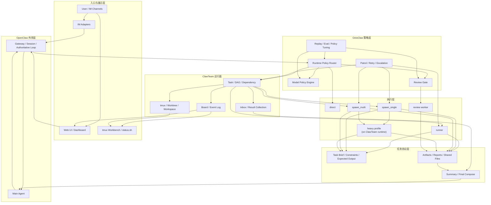

# OctoClaw 产品设计与重构方案 v2 (2026-03-27)

## 1. 文档目的

这份文档不是“借鉴分析”，而是 **OctoClaw 自己的产品设计文档**。

目标是把下面几件事一次写清楚：

- OctoClaw 到底是什么产品
- 它和 OpenClaw、ClawTeam 的边界怎么分
- 为什么要重构，以及重构后长什么样
- 现有 agent 类型要不要改，怎么改
- 接下来按什么步骤实现，风险最小、收益最大

这份文档应作为后续实现的 **canonical design**。

---

## 2. 产品定义

### 2.1 一句话定义

> **OctoClaw 是 OpenClaw 的多 Agent 调度脑、成本脑和展示脑。**

它不应该变成：

- 又一个通用 agent framework
- 又一个模型网关
- 又一个纯任务看板

它应该专注做三件事：

1. **按需分配执行面**
2. **按需分配模型和成本**
3. **把多 Agent 执行过程展示清楚**

### 2.2 产品定位

OctoClaw 的目标不是“会开很多 agent”，而是：

- 主 agent 更快响应
- 子任务更稳定地下沉
- 多 Agent 协作更可控、更可解释
- 复杂任务在不炸上下文和不炸成本的前提下被拆开处理

换句话说：

> **OctoClaw 不是 worker 本身，而是 worker 的调度系统。**

### 2.3 产品方法论：轻量 harness，重型协议按需开启

OctoClaw 可以借鉴 harness engineering，但不能把自己做成一个默认很重的 runtime。

正确方向是：

- 默认全局启用 **lightweight harness**
- 只在复杂任务上叠加 **heavy profile / heavy protocol**

这里的 lightweight harness 指的是：

- runtime policy
- route / dispatch
- brief / summary / artifact
- review gate
- task / inbox / board
- explainable decision

它的目的不是增加层数，而是：

- 减少主上下文膨胀
- 避免 prompt 自觉式委派
- 让决策和收作业更稳定

heavy 部分只在复杂任务上启用，例如：

- checkpoint summary
- 更强的 artifact-first 约束
- 更长超时
- 更严格的 review / merge gate
- 更强的多 worker 协作协议

所以 OctoClaw 的方法论不是：

- “所有请求都上重型 harness”

而是：

> **用轻量 harness 提升效率和降本，再按需叠加重型执行协议。**

---

## 3. 产品目标

### 3.1 主要目标

#### 1. 快响应

- 主 agent 不被慢工具、长检索、长命令阻塞
- 用户尽快收到首响
- 长任务自动转后台继续执行

#### 2. 低成本

- 简单任务不浪费强模型
- 轻工具任务优先 runner
- 子 agent 只拿最小 brief
- 长结果优先 artifact 化

#### 3. 稳定委派

- 委派是系统行为，不是 prompt 习惯
- 子任务状态和交付物是一等公民
- 主 agent 不再靠“想起来”才派单

#### 4. 多 Agent 协作可观察

- 能看到谁在做什么
- 能看到为什么这么路由
- 能看到结果、风险、重试和升级链

#### 5. 多 IM / UI 适配

- 不只在终端里能看
- 不只在飞书里能看
- 同一个任务在不同 IM 里能用最合适的交互方式呈现

### 3.2 非目标

当前阶段不追求：

- 自己造一套全新的大模型网关
- 自己造一套通用多 Agent 框架
- 让 LLM 完全自由决定是否委派
- 为所有复杂任务单独造一套独立 heavy runtime

---

## 4. 设计原则

### 4.1 系统控制边界，模型做局部优化

模型可以辅助判断，但不能独自决定：

- 是否委派
- 委派给谁
- 是否 review
- 是否升级成本

### 4.2 统一运行面，分离执行语义

所有非 `direct` 工作都收敛到统一运行面；
不同的是执行协议，而不是再造多套 runtime。

### 4.2.1 轻量 harness 默认开启

默认应全局开启的能力：

- runtime policy decision
- task / inbox / board 基础协作面
- brief / summary / artifact 协议
- default skill bundle
- explainable route / review reasons

这些能力应该服务于：

- 更快首响
- 更低 token 消耗
- 更稳定委派

而不是把所有任务都升级成复杂长流程。

### 4.3 brief 输入，summary 输出

子任务默认只吃最小任务包：

- goal
- constraints
- expected output
- 必要 artifact refs

主链路默认只回收：

- summary
- status
- artifacts
- next step

### 4.4 artifact first

长结果、日志、草稿、diff、研究材料优先落文件；
主链路不默认吞下完整 transcript。

### 4.5 可解释优先

每一次关键决策都应该能回答：

- 为什么不是 direct
- 为什么不是 runner
- 为什么用了这个模型
- 为什么开了 review
- 为什么升级/重试

---

## 5. 最终产品形态

### 5.1 四层结构

#### 1. OpenClaw 外壳层

负责：

- session
- authoritative loop
- workspace
- channel / user interaction shell

#### 2. OctoClaw 策略层

负责：

- route
- model / profile resolution
- cost / budget / quota policy
- review gate
- patrol / retry / escalation
- final compose policy

#### 3. ClawTeam 运行面

负责：

- task
- inbox
- board
- tmux
- worktree / workspace isolation
- worker observability

#### 4. 执行层

负责真正执行：

- `direct`
- `runner`
- `spawn_single`
- `spawn_multi`

其中复杂任务不是进入独立的新 runtime，而是：

> **在 ClawTeam 运行面上启用更重的 heavy profile / protocol。**

### 5.2 总体架构图



---

## 6. 关键运行机制

### 6.1 route 收敛

最终 route 只保留 4 类：

- `direct`
- `runner`
- `spawn_single`
- `spawn_multi`

说明：

- `heavy` 不再是独立 route
- 它是 `spawn_single / spawn_multi` 上的一种执行协议增强

### 6.2 runner 的定位

`runner` 不是普通 subagent，而是 **特殊 executor**。

它的特点：

- 常驻 daemon
- 每个 job 独立 fresh shell
- 任务快、便宜、稳定
- tmux 里占一个固定服务工位

它解决的是：

- 轻工具任务不要过度 agent 化
- 避免每次都 spawn 一个真正 agent session

### 6.3 spawn_single 的定位

用于：

- 中等复杂度任务
- 单个 worker 足够完成
- 需要隔离上下文
- 但不需要团队 DAG

默认特征：

- 一个 task
- 一个 worker
- 一个 tmux 工位
- 一个 summary / artifact 回传

### 6.4 spawn_multi 的定位

用于：

- 多步骤
- 可并行
- 有依赖
- 需要 planner / worker / reviewer 协作

默认特征：

- task graph
- DAG / dependency
- 多个 worker
- board / inbox / tmux 可观察

### 6.5 heavy profile 的定位

heavy profile 不是新 runtime，而是：

- 更强的 brief schema
- 更长超时
- 更严格的 summary / artifact-first 约束
- 更强的 review / merge gate
- 可选独立 workspace / sandbox

只对这类任务启用：

- 长任务
- 多步研究
- sandbox-heavy
- intermediate artifacts 很多
- recursive exploration 倾向明显

---

## 7. OctoClaw 的核心护城河

OctoClaw 需要有自己的独特价值，不能只是“把 ClawTeam 接进来了”。

我建议把护城河明确成 5 件事。

### 7.1 自动选模型 + 自动选执行面

这是最该做成名片的能力。

不是简单选模型，而是联合决定：

- route
- role / phase
- model / profile
- 是否 review
- 是否启用 heavy profile

决策输入至少包括：

- task shape
- latency sensitivity
- risk
- context growth
- parallel gain
- budget pressure
- quota state
- runtime health
- replay/eval feedback

#### 7.1.1 选模内核应保持可插拔

短期不必单独开源，但必须按“未来可拆出去单独开源”的方式设计。

核心原则：

- 选模内核本身不感知 OpenClaw / ClawTeam
- 输出结构化 decision object，而不是只输出一个 model id
- runtime bridge 才负责把 decision 翻译给 OpenClaw / ClawTeam

推荐结构：

- `catalog adapters`
- `benchmark adapters`
- `economics adapters`
- `policy engine`
- `runtime bridges`

#### 7.1.2 选模内核的输入输出

输入应该包括：

- task shape / work type / phase
- risk
- latency target
- context budget
- available model set
- benchmark snapshot
- quota health
- internal effective cost
- market price baseline

输出不应只是：

- `model=xxx`

而应是：

```json
{
  "decision": {
    "selected_model": "provider/model",
    "profile": "writer-fast",
    "reasoning_effort": "medium",
    "route_class": "spawn_single",
    "protocol": "normal",
    "review_required": false,
    "fallbacks": ["provider/model-b"],
    "scores": {
      "capability": 0.81,
      "latency": 0.77,
      "market_price": 0.18,
      "internal_cost": 0.44,
      "quota_health": 0.82
    },
    "explanation": [
      "doc_task",
      "latency_sensitive",
      "quota_healthy"
    ]
  }
}
```

#### 7.1.3 灰区路由单独设计

`direct / runner / spawn_single / spawn_multi` 的分诊不应只靠关键词，也不应默认依赖远程小模型。

当前建议是：

- 先用硬门禁切掉明显任务
- 对剩余灰区引入 **超轻量双语文本分类器**
- 只有低置信度或高风险灰区才进入受限 planner

灰区路由的详细设计见：

- [octoclaw-grayzone-routing-design-v1-2026-03-27.md](/Users/guanzhicheng/Documents/Playground/openclaw-projects/openclaw-octopus/octoclaw-grayzone-routing-design-v1-2026-03-27.md)

#### 7.1.3 OpenRouter 的正确角色

OctoClaw 设计里应明确：

- **OpenRouter rankings**
  - 只作为 `ecosystem signal`
  - 不作为能力榜真相

- **OpenRouter models API / 公开价格**
  - 只作为 `market price baseline`
  - 不等于你的真实内部成本

也就是说：

- `rankings` 权重应低
- `market_price` 和 `internal_cost` 必须分离
- 任何账号池、订阅池、seat、quota 都只是内部经济适配器的一种实现

#### 7.1.4 选模内核的产品边界

OctoClaw 要做的不是“又一个 router”，而是：

> **一个可插拔的、agent-aware 的 model policy engine。**

这意味着它既服务：

- route
- role / phase
- model/profile
- review gate
- protocol choice

也意味着它后续可以独立出来服务别的多 Agent 产品，但现在先不以开源为目标牵着当前实现走。

### 7.2 IM-native 展示层

OctoClaw 当前应优先支持：

- Feishu
- Slack
- Discord
- Telegram
- 微信（优先评估 ClawBot 插件接入）

暂不作为当前阶段目标：

- 企业微信
- 钉钉

但不是只“能发消息”，而是做统一 capability matrix：

- thread
- card
- button
- approval action
- file upload
- mention
- stream update
- fallback text

然后为每个 IM 做最适合它的 renderer。

### 7.3 终端 + UI 双栈观测

保留：

- `status.sh`
- tmux board / workbench

再补：

- Web UI
- task graph
- artifact explorer
- replay / route diff / policy diff

### 7.4 可解释的自动化

每次关键动作都可解释：

- route reason
- model reason
- review trigger
- retry / escalation reason
- cost / latency explanation

### 7.5 上下文预算管理

这块也应该成为 OctoClaw 的特色：

- brief 输入
- summary 输出
- transcript 默认不上主链路
- 超长结果自动 artifact 化
- 每类 route 维护 context budget

---

## 8. agent 类型是否要改

**要改。**

旧版花名式类型大致是：

- `power`
- `scout`
- `writer`
- `fix`
- `test`
- `analyze`

有两个明显问题：

### 8.1 问题一：语义重叠

例如：

- `scout` 和 `analyze` 很接近
- `writer` 常常只是 research 或 code 的收口阶段
- `test` 更像 review/verify 的一部分
- `power` 其实不是角色，而像“更强一点”

### 8.2 问题二：把“角色、能力、强度”混在一个 label 里

例如：

- `power` 混了“强度”
- `fix` 混了“任务类型”
- `writer` 混了“产物形式”

这样会导致：

- route 不好解释
- model policy 不好统一
- UI 不好展示
- DAG 不好抽象

### 8.3 建议的新结构：从“单标签”改成“三段式”

建议每个非 direct task 至少有这 3 个字段：

- `executor_type`
- `work_type`
- `phase`

再辅以：

- `tier`
- `profile`
- `protocol`

#### 1. executor_type

- `runner`
- `subagent`
- `team`

#### 2. work_type

- `ops`
- `research`
- `code`
- `review`

#### 3. phase

- `inspect`
- `collect`
- `implement`
- `verify`
- `merge`
- `report`

#### 4. tier

- `fast`
- `normal`
- `strong`
- `heavy`

#### 5. protocol

- `normal`
- `heavy`

### 8.4 推荐的固定 worker pool

我建议最终收敛成 4 个主 worker pool + 1 个特殊 executor：

#### `octoclaw-runner`

- 特殊 executor
- 负责轻工具、状态、shell、API、日志

#### `octoclaw-research`

- 负责调研、检索、对比、资料归纳、写 summary

#### `octoclaw-code`

- 负责实现、修复、脚本、改配置、补测试

#### `octoclaw-review`

- 负责验证、风控、merge、质量把关

#### `octoclaw-main`

- 不是 worker pool，而是主链路协调者

### 8.5 `writer` 是否需要保留为角色

我的建议是：

- 对外可以保留 `writer` 这个用户可理解的 preset / profile
- 对内不要把 `writer` 做成基础 worker pool

原因：

- 很多任务确实“不写代码，只写文档”
- 但这类任务本质上通常还是 `research + report` 或 `code + report`
- `writer` 更像面向产物和协作体验的 profile，而不是调度层的基本工作类型

建议落法：

- 文档/知识类任务：`work_type=research, phase=report, profile=writer`
- 代码说明/变更总结类任务：`work_type=code, phase=report, profile=writer`
- 真正调度时仍然主要看 `executor_type + work_type + phase`

### 8.6 角色 / profile 是否要绑默认 skill

需要，但建议用“默认 skill bundle + 动态补充”的混合模式。

不建议：

- 完全手写死每个角色只能用哪些 skill
- 完全放任模型自己临场找 skill

建议：

- runtime policy 按 `work_type` / `profile` 注入默认 skill bundle
- agent 仍可在执行时自动发现额外 skill

例如：

- `profile=writer` 默认给文档/飞书/Office/交付格式相关 skill
- `work_type=code` 默认给 repo/test/review 相关 skill
- `work_type=review` 默认给验证、风险、回归检查相关 skill

这样能兼顾：

- 首次命中率
- 可解释性
- 灵活性

### 8.7 旧类型如何映射

兼容期建议这样映射：

- `scout` -> `work_type=research, phase=collect`
- `analyze` -> `work_type=research|review, phase=inspect`
- `writer` -> `work_type=research|code, phase=report, profile=writer`
- `fix` -> `work_type=code, phase=implement`
- `test` -> `work_type=review, phase=verify`
- `power` -> `tier=heavy`，不再作为长期角色名保留

### 8.8 最终建议

> **长期应从“花名式角色标签”迁到“执行器 + 工作类型 + 阶段 + tier/protocol”模型。**

这样更适合：

- runtime policy
- model selection
- review gate
- ClawTeam task schema
- UI 和 IM 展示

---

## 9. 任务协议设计

### 9.1 brief 输入协议

建议统一为：

```json
{
  "task_id": "T123",
  "goal": "修复登录接口 401 问题",
  "constraints": [
    "优先最小改动",
    "不要改数据库 schema"
  ],
  "context_summary": "最近改动涉及 auth middleware，用户反馈部署后持续 401",
  "expected_output": {
    "summary": "string",
    "status": "done|blocked|failed",
    "artifacts": ["path-or-id"],
    "next_step": "string"
  }
}
```

### 9.2 worker 输出协议

建议统一为：

```json
{
  "task_id": "T123",
  "status": "done",
  "summary": "定位到 token 解析顺序错误",
  "artifacts": ["patch.diff"],
  "risks": ["需要验证旧 token 兼容性"],
  "next_step": "建议交给 review worker 检查 auth 边界"
}
```

### 9.3 heavy profile 的协议增强

heavy profile 额外要求：

- 更完整的 constraints
- 更明确的 deliverables
- 中间结果优先 artifact 化
- 必须有 checkpoint summary
- 默认走 review gate

---

## 10. ClawTeam 依赖边界

ClawTeam 是 OctoClaw 当前唯一需要明确依赖进核心设计里的外部 runtime。

### 10.1 ClawTeam 负责什么

- task
- inbox
- board
- tmux
- worktree
- worker visibility

### 10.2 ClawTeam 不负责什么

- route
- model policy
- review policy
- budget/quota policy
- patrol / escalation policy

### 10.3 结论

> **ClawTeam 是运行面，不是策略脑。**

---

## 11. 实现步骤方案

### Phase 0：统一数据模型

目标：

- 先把文档里的 schema 变成代码里的真实 schema

要做：

- 给 task 增加统一字段：
  - `executor_type`
  - `work_type`
  - `phase`
  - `tier`
  - `protocol`
- 保留旧 `label` 作为兼容字段
- 增加旧类型到新结构的映射层

输出：

- schema v2
- backward-compatible mapper

并行要求：

- 选模 decision schema 同步定稿
- 明确 `market_price` / `internal_cost` / `quota_health` 字段
- 不把任何外部网关或账号池机制写死进核心数据模型

### Phase 1：把委派变成 runtime policy

目标：

- 不再主要靠 `AGENTS.md` / `skills` 决定委派
- 让委派、review、skill bundle 进入 runtime policy

要做：

- 前置 router
- delegate/review hard gate
- route decision object
- direct / runner / single / multi 的强制入口
- 按 `work_type` / `profile` 选择默认 skill bundle
- 保留精简版 `AGENTS.md` 注入，只承载静态规则和协作约定

输出：

- runtime policy entry
- route decision schema
- explainable route reasons

建议第一版直接产出一个稳定 decision object，例如：

```json
{
  "schema_version": "octoclaw.runtime_policy.decision/v1",
  "summary": "policy=spawn_single -> octoclaw-code / code:implement / strong / profile=code / model=...",
  "route_decision": {
    "route": "spawn_single",
    "executor_type": "subagent",
    "worker_pool": "octoclaw-code",
    "work_type": "code",
    "phase": "implement",
    "protocol": "normal"
  },
  "model_policy": {
    "tier": "strong",
    "selected_model": "...",
    "profile": "code",
    "reasoning_effort": "high"
  },
  "skill_policy": {
    "default_skill_bundle": ["repo", "test", "review"],
    "dynamic_discovery_allowed": true
  },
  "review_policy": {
    "required": true,
    "review_worker_pool": "octoclaw-review"
  },
  "hook_interface": {
    "before_model_resolve": { "enabled": true, "action": "override_model_selection" },
    "before_prompt_build": { "enabled": true, "action": "inject_policy_context" },
    "before_tool_call": { "enabled": true, "action": "enforce_delegation_policy" },
    "agent_end": { "enabled": true, "action": "collect_summary_and_artifacts" }
  }
}
```

第一阶段重点不是把所有 hook 都真正接进上游，而是：

- 先固定 schema
- 先固定 tool / command entry
- 先让 `dispatch` / `spawn` / `UI` / `ClawTeam metadata` 都能消费同一个 decision object

并行要求：

- `AGENTS.md` 只保留静态规则
- `skills` 只保留能力和模板
- skill bundle 进入 runtime policy

### Phase 2：把 ClawTeam 运行面彻底打通

目标：

- 所有非 direct 任务都进入统一 task/inbox/board/tmux

要做：

- runner 进入共享 task shell
- spawn_single 进入共享 worker shell
- spawn_multi 进入 DAG runtime
- task / inbox / artifact / board 字段对齐

输出：

- 一个统一的协作控制面

### Phase 3：重构 worker 类型

目标：

- 从旧花名式 label 迁到新 worker pool 模型

要做：

- 新增：
  - `octoclaw-research`
  - `octoclaw-code`
  - `octoclaw-review`
  - `octoclaw-runner`
- 旧 label 继续兼容一段时间
- route 和 model policy 改读新字段
- status / patrol / UI 改渲染新字段

输出：

- 新 worker taxonomy 生效

### Phase 4：把 brief / summary / artifact 协议做实

目标：

- 降上下文成本
- 稳定交付物格式

要做：

- 统一 brief input schema
- 统一 worker result schema
- artifact first
- report / summary / next_step 固定结构

输出：

- DeerFlow-like execution protocol on ClawTeam

### Phase 5：叠加 heavy profile

目标：

- 不新增 runtime 的前提下支持重任务

要做：

- 给 `spawn_single / spawn_multi` 增加 `protocol=heavy`
- 更长 timeout
- 更严格 artifact/checkpoint
- review gate 默认开启
- 可选更强 workspace / sandbox

输出：

- heavy profile on unified runtime

### Phase 6：做展示层产品化

目标：

- 让 OctoClaw 有真正可见的产品价值

要做：

- `status.sh` 收敛为 operator view
- tmux board/workbench 收敛为 live ops view
- Web UI 做：
  - task graph
  - task detail
  - artifact explorer
  - route/model/review explanation
  - patrol event timeline
- IM renderer 做 capability matrix

输出：

- CLI + tmux + Web + IM 四层展示面

### Phase 7：做策略闭环

目标：

- 让 OctoClaw 越跑越准

要做：

- replay
- eval
- route diff
- policy diff
- 成本/时延/成功率回写
- rankings / market price / local telemetry 定期刷新

输出：

- self-tuning policy loop

---

## 12. 推荐的开发优先级

如果只能按收益排序，我建议是：

1. **Phase 1：runtime policy**
2. **Phase 2：ClawTeam 统一运行面**
3. **Phase 3：worker 类型重构**
4. **Phase 4：brief/summary/artifact 协议**
5. **Phase 6：展示层**
6. **Phase 5：heavy profile**
7. **Phase 7：策略闭环**

说明：

- `heavy profile` 不是最早该做的
- 先把普通多 Agent 做稳，比先做重模式更值

---

## 13. 最终结论

OctoClaw 未来最应该长成的，不是“更多 agent”，而是：

> **一个能够稳定分派、稳定降本、稳定展示、稳定解释的 OpenClaw 多 Agent 调度系统。**

它的核心竞争力应该来自：

- 自动选模型 + 自动选执行面
- runtime policy 而不是 prompt 习惯
- ClawTeam 统一运行面
- brief / summary / artifact 协议
- IM-native + UI + tmux 三位一体展示

这才是最值得投入重构的方向。

---

## 14. 参考

核心依赖方向：

- [ClawTeam](https://github.com/HKUDS/ClawTeam)

思想参考：

- [DeerFlow](https://github.com/bytedance/deer-flow)
- [OpenHands Delegation](https://docs.openhands.dev/sdk/guides/agent-delegation)
- [MetaGPT](https://github.com/FoundationAgents/MetaGPT)
- [HiClaw](https://github.com/alibaba/hiclaw)
- [LangGraph Supervisor](https://github.com/langchain-ai/langgraph-supervisor-py)
- [OpenRouter Models](https://openrouter.ai/models)
- [OpenRouter Rankings](https://openrouter.ai/rankings)
