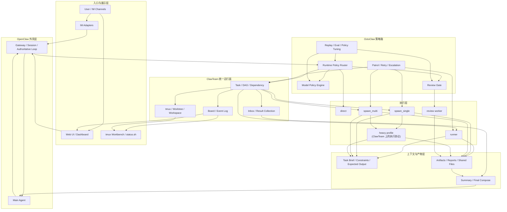

# OctoClaw 策略总纲 (2026-03-26)

## 1. 一句话定位

> **OpenClaw 做壳，OctoClaw 做脑，ClawTeam 做运行面，DeerFlow 提供重任务执行思想。**

如果再压缩一点：

> **OctoClaw 不该变成又一个通用多 Agent 框架，而应该成为 OpenClaw 生态里最强的调度脑、成本脑和展示脑。**

---

## 2. 这几轮讨论后的最终判断

### 2.1 ClawTeam

**不是只借思想，而是要直接复用 runtime / CLI。**

最值得复用：

- `task`
- `inbox`
- `board`
- `tmux`
- `worktree`
- `launch`

在 OctoClaw 里的角色：

- 统一非 `direct` 任务的共享运行面
- 统一任务状态、收作业、协作和人工接管

### 2.2 DeerFlow

**借思想，不整套嵌入。**

最值得借：

- execution mode 分层
- isolated sub-agent context
- brief / summary / artifact 协议
- aggressive summarization
- heavy protocol / heavy profile 只在复杂任务触发

不建议直接复用：

- 主 lead agent
- 整套 orchestration loop
- 自带 memory/runtime 控制层

### 2.3 LangGraph

**借 graph semantics，不急着引 runtime。**

最值得借：

- graph state
- node / edge / conditional routing
- checkpoint / pause / resume
- supervisor pattern

### 2.4 其他开源项目

#### OpenHands

**高优先级借鉴。**

借：

- delegation 做成一等工具
- `spawn` / `delegate` 分离
- 并行与 fan-out 限制
- tracing / context condensation

#### MetaGPT

**中高优先级，主要借 code pipeline。**

借：

- 角色 SOP
- 固定产物格式
- `spec -> implement -> test -> review`

#### HiClaw

**中优先级，借局部思想。**

借：

- 透明协作
- shared file system
- gateway secret isolation

不建议整套采用：

- Matrix / IM-first runtime

#### CrewAI

**可以借，但优先级靠后。**

借：

- autonomy 和 determinism 分层
- flow 保留控制权

---

## 3. 最终不采用的方向

### 3.1 不让 DeerFlow 当主调度器

原因：

- 会和 OpenClaw / OctoClaw 抢控制权
- 会形成双调度器、双状态机、双上下文管理

### 3.2 不让 AGENTS.md / skills 承担强制委派

原因：

- 服从度不稳定
- 属于软约束
- 不能承担 runtime enforcement

### 3.3 暂不采用 RouteLLM

原因：

- 更偏 `2-model routing`
- 中文支持优势不明确
- 不能解决 OctoClaw 更核心的 `direct / runner / single / multi / review`
- 引入复杂度大于当前收益

### 3.4 不急着额外引入 LangGraph runtime

原因：

- 当前已经有 OpenClaw + OctoClaw + ClawTeam 这条更贴实际的路线
- 再引 LangGraph runtime 会增加重叠和复杂度

---

## 4. OctoClaw 自己真正该做成什么

OctoClaw 不应该靠“又多接了几个框架”立足，而要靠自己的核心优势立足。

我认为最值得做成护城河的是这 5 件事。

### 4.1 自动选模型 / 自动选执行面

这是 OctoClaw 最有机会形成差异化的地方。

不是简单的 per-role model map，而是：

- `route`
- `model/profile`
- `review`
- `budget`
- `quota`
- `latency`
- `context growth`

联合决策。

目标是：

- 不是只问“用哪个模型”
- 而是同时决定：
  - 用不用 agent
  - 用几个 agent
  - 要不要 review
  - 要不要启用 heavy profile

### 4.2 IM-native 的多 Agent 交互体验

OctoClaw 不应该只停留在“飞书能发卡片”。

应该做成：

- Feishu
- Slack
- Discord
- Telegram
- 微信（优先评估 ClawBot 插件）

统一 capability matrix + renderer。

当前先不做：

- 企业微信
- 钉钉

目标不是“每个平台都能发消息”，而是：

- 每个平台都能用最适合它的交互方式展示 route / task / approval / result

### 4.3 终端 + UI 双栈可视化

两条都要：

- `status.sh` / tmux workbench：面向 operator
- Web UI：面向调试、演示、观察和回放

值得展示的核心数据：

- task graph
- current route
- model/profile
- worker status
- inbox / artifacts
- patrol events
- retry/escalation chain
- cost / latency

### 4.4 可解释的自动化

很多多 Agent 系统的痛点不是不会自动，而是自动成黑盒。

OctoClaw 应该反过来做成：

- 每次 route 都有 reason
- 每次选模都有 reason
- 每次 review 都有 trigger reason
- 每次重试 / 升级都有 event
- 每次失败都能 replay

### 4.5 上下文预算管理

这个可以成为 OctoClaw 的另一个鲜明特色。

规则应该显式：

- 子任务默认只吃 brief
- 主链路默认只吃 summary
- transcript 默认不回主链路
- 超长结果优先 artifact 化
- 每种 route 都有 context budget

---

## 5. 推荐的最终架构

### 5.1 四层结构

#### 1. OpenClaw layer

- session
- authoritative loop
- workspace
- 用户入口

#### 2. OctoClaw policy layer

- route
- model tier / profile resolution
- cost / budget / quota policy
- review gate
- patrol / retry / escalation

#### 3. ClawTeam runtime layer

- task
- inbox
- board
- tmux
- worktree
- worker observability

#### 4. Heavy profile on ClawTeam runtime

- 长任务
- 多步研究
- sandbox-heavy
- recursive exploration
- 更强的 brief / summary / artifact 约束

### 5.2 route 收敛

建议明确收敛成：

- `direct`
- `runner`
- `spawn_single`
- `spawn_multi`

其中：

- `heavy profile` 不是独立 route
- 它是 `spawn_single / spawn_multi` 上的执行协议增强
- 只有复杂研究、长流程、sandbox-heavy 才启用

### 5.3 最终架构图

---

## 6. 委派怎么做才会稳

### 6.1 不是只靠 prompt

稳定委派不能主要依赖：

- `AGENTS.md`
- `SKILL.md`
- prompt 注入

它们适合做：

- 铁律
- 能力说明
- 子任务模板

### 6.2 真正要稳的是 runtime policy

应该做成：

- 前置 router
- runtime policy
- delegate/review 结构化工具
- hard gate

也就是：

用户请求
-> route decision
-> create task(s)
-> assign runtime / worker pool
-> collect summaries
-> optional review
-> final compose

### 6.3 AGENTS / skills / 插件 三层分工

#### `AGENTS.md`

负责：

- 静态铁律
- repo / 团队长期协作约定
- 主 agent 必须优先用 OctoClaw runtime

#### `skills`

负责：

- 工具说明
- 能力包
- 流程建议
- 按 profile/work_type 提供可复用 skill bundle

#### 插件 / middleware / runtime policy

负责：

- 是否委派
- 委派给谁
- 是否 review
- 选模型 / 选 profile
- 选默认 skill bundle
- 阻止主 agent 直接做不该自己做的重任务

结论：

- runtime policy 负责“哪些行为必须发生”
- `AGENTS.md` 仍然需要注入，但只保留静态规则，不再承担强制委派
- `skills` 负责能力包，默认 bundle 由 runtime policy 决定，执行时仍允许自动补充发现

---

## 7. 模型选择这块怎么分工

### 7.1 LiteLLM

可以考虑作为底层模型网关。

适合负责：

- provider 统一接入
- fallback
- load balancing
- spend tracking

不适合负责：

- route
- review gate
- `direct / runner / single / multi`

### 7.2 RouteLLM

当前建议：

- **先不用**

原因：

- 更偏 query-level 2-model routing
- 中文优势不明确
- 无法覆盖 OctoClaw 更高层的执行面选择

### 7.3 OctoClaw 自己保留的核心

OctoClaw 必须自己保留：

- route + model + review + budget 联合决策
- role-aware / task-aware / context-aware / quota-aware policy

这才是它最值钱的地方。

---

## 8. 推荐的重构顺序

### Phase 1：把委派变成系统行为

- 前置 router
- runtime policy
- delegate/review hard gate

### Phase 2：把协作控制面全面 ClawTeam 化

- 所有非 `direct` 任务统一进入 task/inbox/board
- tmux 成为默认工作台
- runner 作为特殊 executor 接入统一运行面

### Phase 3：把子任务协议全面 DeerFlow 化

- brief 输入
- summary 输出
- artifact first
- 文件系统下沉中间结果

### Phase 4：把 heavy profile 叠到 ClawTeam runtime 上

- 只在 `spawn_single / spawn_multi` 上启用
- 更强的 brief schema
- 更强的 summary / artifact 规范
- 更长超时与更强 review gate
- 必要时独立 workspace / sandbox

### Phase 5：把展示做成产品级

- 终端状态面板
- tmux board
- Web UI
- IM-native renderers

---

## 9. 一句话版优先级

### 必做

- 继续复用 ClawTeam runtime
- 借 DeerFlow 的 execution philosophy
- 强化 OctoClaw 自己的 model/routing policy
- 把委派前置成 runtime policy

### 应做

- 借 OpenHands delegation 设计
- 借 MetaGPT code pipeline
- 做 IM-native renderer + Web UI

### 可做

- 借 HiClaw 的透明协作、shared FS、secret isolation
- 借 CrewAI 的 flow 思想
- 借 LangGraph 的 graph semantics

### 暂不做

- RouteLLM 进入主链路
- DeerFlow 主 runtime 直接嵌入
- 额外引入 LangGraph runtime 当主框架

---

## 10. 当前最清晰的目标

OctoClaw 不该变成“又一个多 Agent 框架”，而应该变成：

> **最懂怎么分派、怎么省钱、怎么展示、怎么解释的 OpenClaw 多 Agent 调度系统。**

这才是它在开源生态里最容易站住的位置。
